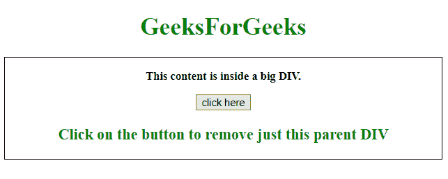
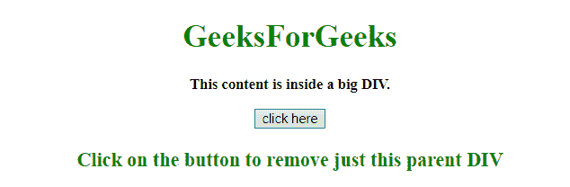

# 如何使用 jQuery 移除除子元素以外的父元素？

> 原文:[https://www . geeksforgeeks . org/如何使用-jquery/](https://www.geeksforgeeks.org/how-to-remove-parent-element-except-its-child-element-using-jquery/) 移除父元素-除了它的子元素

给定一个 HTML 文档，任务是移除除子元素之外的父元素。

**方法 1:**

*   使用 contents()方法选择所有直接子元素，包括所选元素的文本和注释节点。
*   选定的元素存储在变量中。
*   现在，使用 replaceWith()方法将父元素的内容替换为存储在变量中的所有子元素。

**示例:**本示例使用 contents()和 replaceWith()方法移除父元素，但其子元素除外。

```html
<!DOCTYPE HTML> 
<html> 

<head> 
    <title> 
        Remove the parent element not
        its child using jQuery
    </title>

    <script src = 
"https://ajax.googleapis.com/ajax/libs/jquery/3.4.0/jquery.min.js">
    </script>
</head>

<body style = "text-align:center;"> 
    <h1 style = "color:green;" id = "h1"> 
        GeeksForGeeks 
    </h1>

    <div id = "parent" style = "border: 1px solid black;">

        <p id = "GFG_UP" style = 
            "font-size: 15px; font-weight: bold;">
        </p>

        <button onclick = "GFG_Fun()">
            click here
        </button>

        <p id = "GFG_DOWN" style =
            "color:green; font-size: 20px; font-weight: bold;">
        </p>

    </div>

    <script> 
        var up = document.getElementById('GFG_UP');
        up.innerHTML = "This content is inside a big DIV.";
        var down = document.getElementById('GFG_DOWN');

        down.innerHTML = "Click on the button to remove "
                        + "just this parent DIV";

        var heading = document.getElementById('h1');

        function GFG_Fun() {
            var content = $("#parent").contents();
            $("#parent").replaceWith(content);
        }
    </script> 
</body> 

</html>
```

**输出:**

*   **点击按钮前:**



*   **点击按钮后:**



**方法 2:** 该方法使用 unwrap()方法从所选元素中移除父元素。
T3】例:

```html
<!DOCTYPE HTML>
<html>

<head>
    <title>
        Remove the parent element not
        its child using jQuery
    </title>

    <script src =
"https://ajax.googleapis.com/ajax/libs/jquery/3.4.0/jquery.min.js">
    </script>
</head>

<body style = "text-align:center;">

    <h1 style = "color:green;" id = "h1">
        GeeksForGeeks
    </h1>

    <div id = "parent" style = "border: 1px solid black;">

        <p id = "GFG_UP" style =
            "font-size: 15px; font-weight: bold;">
            This content is inside a big DIV.
        </p>

        <button onclick = "GFG_Fun()">
            click here
        </button>

        <p id = "GFG_DOWN" style =
            "color:green; font-size: 20px; font-weight: bold;">
            Click on the button to remove just this parent DIV
        </p>
    </div>

    <script>
        function GFG_Fun() {
            $("#parent").contents().unwrap();
        }
    </script>
</body>

</html>
```

**输出:**

*   **点击按钮前:**


*   **点击按钮后:**

