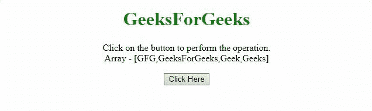

# 如何使用 jQuery 从数组中移除特定值？

> 原文:[https://www . geeksforgeeks . org/如何使用-jquery/](https://www.geeksforgeeks.org/how-to-remove-specific-value-from-array-using-jquery/) 从数组中移除特定值

给定一个数组元素，任务是在 JQuery 的帮助下从数组中移除特定的值元素。下面讨论两种方法:

**方法 1:** 我们可以用 [**而不是()方法**](https://www.geeksforgeeks.org/jquery-not-method-with-examples/) 去掉我们想要的元素。之后，使用 [**get()方法**](https://www.geeksforgeeks.org/jquery-get-method/) 从数组中获取剩余的元素。

*   **例:**

    ```html
    <!DOCTYPE HTML>
    <html>

    <head>
        <title>
            Remove certain property for all objects
            in array with JavaScript.
        </title>

        <script src=
    "https://ajax.googleapis.com/ajax/libs/jquery/3.4.0/jquery.min.js">
        </script>
    </head>

    <body style="text-align:center;">

        <h1 style="color: green">
            GeeksForGeeks
        </h1>

        <p id="GFG_UP"></p>

        <button onclick="gfg_Run()">
            Click Here
        </button>

        <p id="GFG_DOWN" style="color:green;"></p>

        <script>
            var el_up = document.getElementById("GFG_UP");
            var el_down = document.getElementById("GFG_DOWN");
            var arr = ["GFG", "GeeksForGeeks", "Geek", "Geeks"];
            var remEl = "Geek";
            el_up.innerHTML = "Click on the button to perform "
                    + "the operation.<br>Array - [" + arr + "]";

            function gfg_Run() {
                var arr2 = $(arr).not([remEl]).get();
                el_down.innerHTML = "[" + arr2 + "]";
            } 
        </script>
    </body>

    </html>
    ```

*   **输出:**
    

**方法二:**我们可以使用 **inArray()方法**获取元素(即要移除的)的索引，然后使用[T5】slice()方法 T7】获取剩余的元素。](https://www.geeksforgeeks.org/jquery-slice-with-examples/)

*   **例:**

    ```html
    <!DOCTYPE HTML>
    <html>

    <head>
        <title>
            Remove certain property for all objects
            in array with JavaScript.
        </title>

        <script src=
    "https://ajax.googleapis.com/ajax/libs/jquery/3.4.0/jquery.min.js">
        </script>
    </head>

    <body style="text-align:center;">

        <h1 style="color: green">
            GeeksForGeeks
        </h1>

        <p id="GFG_UP"></p>

        <button onclick="gfg_Run()">
            Click Here
        </button>

        <p id="GFG_DOWN" style="color:green;"></p>

        <script>
            var el_up = document.getElementById("GFG_UP");
            var el_down = document.getElementById("GFG_DOWN");
            var arr = ["GFG", "GeeksForGeeks", "Geek", "Geeks"];
            var remEl = "Geek";
            el_up.innerHTML = "Click on the button to perform "
                    + "the operation.<br>Array - [" + arr + "]";

            function gfg_Run() {
                arr.splice($.inArray(remEl, arr), 1);
                el_down.innerHTML = "[" + arr + "]";
            } 
        </script>
    </body>

    </html>
    ```

*   **输出:**
    