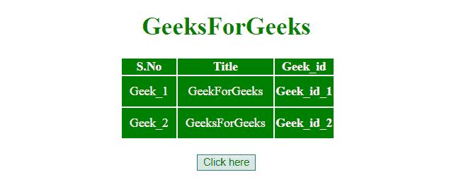
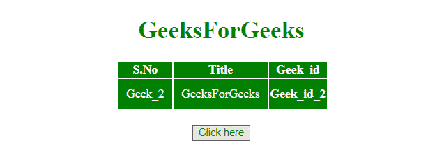
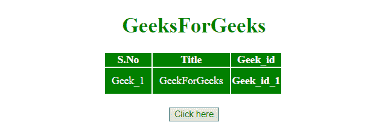

# 如何使用 jQuery 从表中删除表行？

> 原文:[https://www . geeksforgeeks . org/如何使用-jquery 从表中删除表行/](https://www.geeksforgeeks.org/how-to-remove-table-row-from-table-using-jquery/)

jQuery remove()方法用于从 HTML 表中删除一个**行**。
**[jQuery remove()方法](https://www.geeksforgeeks.org/jquery-remove/) :** 此方法移除所选元素以及文本和子节点。此方法还会移除选定元素的数据和事件。

**语法:**

```html
$(selector).remove(selector)
```

**参数:**接受单参数**选择器**，可选。它指定要删除的一个或多个元素。如果要删除多个元素，请用逗号(，)运算符分隔它们。

**示例 1:** 本示例首先通过 **id 值**选择行，然后使用 **remove()方法**将其删除。

```html
<!DOCTYPE HTML> 
<html> 
    <head> 

        <title> 
            How to remove a table row
            from table
        </title> 

        <script src = 
"https://ajax.googleapis.com/ajax/libs/jquery/3.4.0/jquery.min.js">
        </script>

        <style>
            #myCol {
                background:green;
            }
            table {
                color:white;
            }
            #Geek_p {
                color:green;
                font-size:30px;
            }
            td {
                padding:10px;
            }
        </style>
    </head> 

    <body>
        <center> 
            <h1 style = "color:green;" > 
                GeeksForGeeks 
            </h1> 

            <table>
                <colgroup>
                    <col id="myCol"
                        span="2">
                    <col style="background-color:green">
                </colgroup>

                <tr>
                    <th>S.No</th>
                    <th>Title</th>
                    <th>Geek_id</th>
                </tr>
                <tr id = "row1">
                    <td>Geek_1</td>
                    <td>GeekForGeeks</td>
                    <th>Geek_id_1</th>
                </tr>
                <tr>
                    <td>Geek_2</td>
                    <td>GeeksForGeeks</td>
                    <th>Geek_id_2</th>
                </tr>
            </table>
            <br>

            <button onclick = "Geeks()"> 
                Click here
            </button> 

            <!-- Script to remove table row from table -->
            <script> 
                function Geeks() {
                        $("#row1").remove();
                }
            </script>
        </center>
    </body> 
</html>                    
```

**输出:**

*   **点击按钮前:**
    
*   **点击按钮后:**
    

**示例 2:** 本示例首先选择其父元素的最后一个< tr >元素，并使用 **remove()方法**将其移除。

```html
<!DOCTYPE HTML> 
<html> 
    <head> 
        <title> 
            How to remove table row
            from table
        </title> 

        <script src = 
"https://ajax.googleapis.com/ajax/libs/jquery/3.4.0/jquery.min.js">
        </script>

        <style>
            #myCol {
                background:green;
            }
            table {
                color:white;
            }
            #Geek_p {
                color:green;
                font-size:30px;
            }
            td {
                padding:10px;
            }
        </style>
    </head> 

    <body>
        <center> 
            <h1 style = "color:green;" > 
                GeeksForGeeks 
            </h1> 

            <table>
                <colgroup>
                    <col id="myCol"
                        span="2">
                    <col style="background-color:green">
                </colgroup>

                <tr>
                    <th>S.No</th>
                    <th>Title</th>
                    <th>Geek_id</th>
                </tr>
                <tr id = "row1">
                    <td>Geek_1</td>
                    <td>GeekForGeeks</td>
                    <th>Geek_id_1</th>
                </tr>
                <tr>
                    <td>Geek_2</td>
                    <td>GeeksForGeeks</td>
                    <th>Geek_id_2</th>
                </tr>
            </table>
            <br>

            <button onclick = "Geeks()"> 
                Click here
            </button> 

            <script> 
                function Geeks() {
                    $('tr:last-child').remove();
                }
            </script> 
        </center>
    </body> 
</html>                    
```

**输出:**

*   **点击按钮前:**
    
*   **点击按钮后:**
    

jQuery 是一个开源的 JavaScript 库，它简化了 HTML/CSS 文档之间的交互，它以其“少写多做”的理念而闻名。
跟随本 [jQuery 教程](https://www.geeksforgeeks.org/jquery-tutorials/)和 [jQuery 示例](https://www.geeksforgeeks.org/jquery-examples/)可以从头开始学习 jQuery。