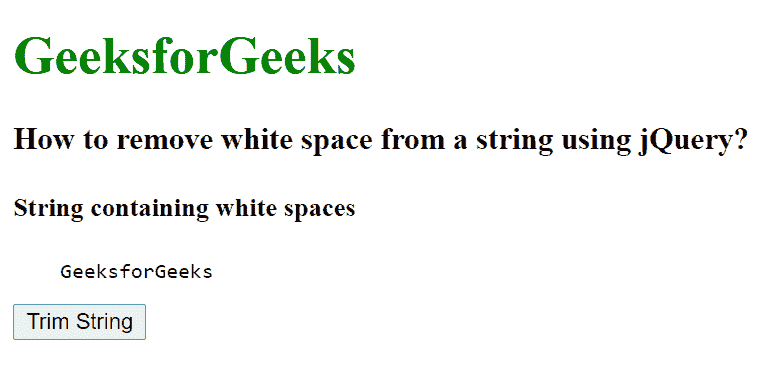
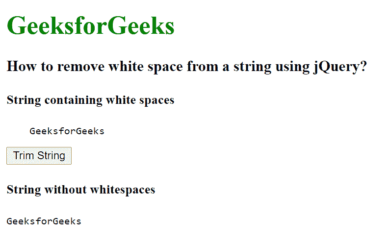

# 如何使用 jQuery 删除字符串中的空格？

> 原文:[https://www . geeksforgeeks . org/如何使用-jquery/](https://www.geeksforgeeks.org/how-to-remove-white-spaces-from-a-string-using-jquery/) 从字符串中删除空格

在本文中，我们将看到如何使用 jQuery 从字符串中删除空格。要删除空白，我们将使用 trim()方法。trim()方法用于删除字符串开头和结尾的空格。

**语法:**

```html
jQuery.trim( str )
```

**参数:**此方法接受要修剪的单个参数字符串。

在这种情况下，我们在

```html
标签中写入包含空格的字符串，然后应用 trim()方法从开始和结束位置移除所有空格。删除空白后，我们使用 html()方法显示修剪后的字符串。
```

**示例:**

## 超文本标记语言

```html
<!DOCTYpe html>
<html>

<head>
    <title>
        How to remove white space from
        a string using jQuery?
    </title>

    <script src=
"https://ajax.googleapis.com/ajax/libs/jquery/3.3.1/jquery.min.js">
    </script>

    <script>
        $(document).ready(function () {
            $("h1").css("color", "green");
            $("button").click(function () {
                $(".str").html("String without whitespaces");
                var str = $(".string").text();
                var trimStr = $.trim(str);
                $(".res-string").html(trimStr);
            })
        });
    </script>
</head>

<body>
    <h1>GeeksforGeeks</h1>

    <h3>
        How to remove white space from
        a string using jQuery?
    </h3>

    <h4>String containing white spaces</h4>
    <pre class="string">    GeeksforGeeks       </pre>

    <button>Trim String</button>

    <h4 class="str"></h4>
    <pre class="res-string"></pre>
</body>

</html>
```

**输出:**

 