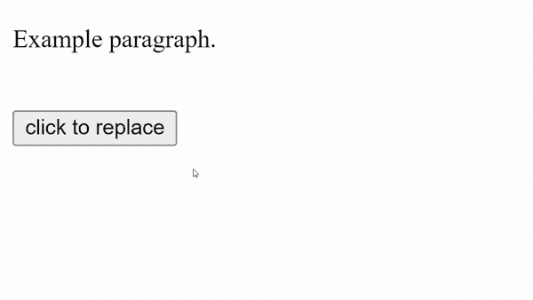
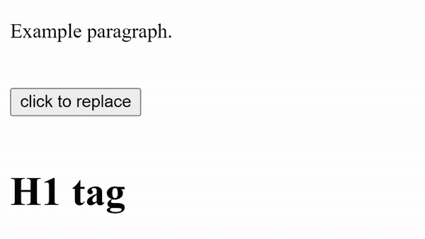
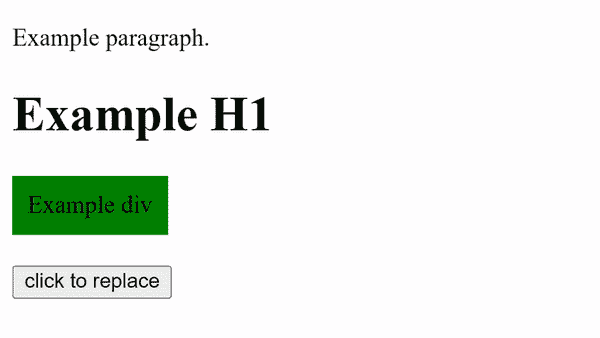

# 如何替换 jQuery 中的 HTML 元素？

> 原文:[https://www . geesforgeks . org/如何替换-html-element-in-jquery/](https://www.geeksforgeeks.org/how-to-replace-html-element-in-jquery/)

我们可以使用 jQuery [*来替换 HTML 元素。*replace with()](https://www.geeksforgeeks.org/jquery-replacewith-with-examples/)法。使用 jQuery *replaceWith()* 方法，我们可以用提供的新内容替换匹配元素集中的每个元素，并返回被移除的元素集。

*。replaceWith()* 方法从 DOM 中移除内容，并通过一次调用在适当的位置插入新内容。

**语法:**

```
replaceWith( newContent )
```

```
.replaceWith( function )
```

**返回值:** 该方法返回有变化的选中元素。

**注:**jQuery*。replaceWith()* 方法，返回 jQuery 对象，以便其他方法可以链接到它上面。但是，必须注意的是，返回了原始的 jQuery 对象。这个对象指的是已经从 DOM 中移除的元素，而不是替换它的新元素。

**示例 1:** 我们获取需要替换的元素，并编写一个新元素来代替它。

## 超文本标记语言

```
<!DOCTYPE html>
<html>
    <head>
        <script
            src=
"https://ajax.googleapis.com/ajax/libs/jquery/3.5.1/jquery.min.js">
        </script>
        <script>
            $(document).ready(function(){
                $("button").click(function(){
                    $("p").replaceWith
                    ("<div style='width:200px;height:100px;\
                    background-color:red;text-align:center;\
                    vertical-align:middle;display:table-cell'>\
                    <strong>new div</strong></div>");
                });
            });
        </script>
    </head>
    <body> 

<p>Example paragraph.</p>

      <button style="margin: 20px 0px;">
        click to replace 
      </button>
    </body>
</html>
```

**输出:**



**示例 2:** 我们还可以用另一个现有的 HTML 元素替换一个 HTML 元素。

## 可扩展标记语言

```
<!DOCTYPE html>
<html>
    <head>
        <script src=
"https://ajax.googleapis.com/ajax/libs/jquery/3.5.1/jquery.min.js">
        </script>
        <script>
            $(document).ready(function(){
                $("button").click(function(){
                    $("p").replaceWith($("h1"))
                });
            });
        </script>
    </head>
    <body> 

<p>Example paragraph.</p>

      <button style="margin: 20px 0px;">
        click to replace 
      </button>

      <h1>H1 tag</h1>
    </body>
</html>
```

**输出:**



**例 3:** 我们可以同时替换多个 HTML 元素。

## 超文本标记语言

```
<!DOCTYPE html>
<html>
    <head>
        <script 
            src=
"https://ajax.googleapis.com/ajax/libs/jquery/3.5.1/jquery.min.js">
        </script>
        <script>
            $(document).ready(function(){
                $("button").click(function(){
                    $(".X").replaceWith("<h3>new element</h3>")
                });
            });
        </script>
    </head>
    <body> 

      <p class="X">Example paragraph.</p>

      <h1 class="X">Example H1</h1>
      <div 
         style="width: fit-content;
                background-color: green;
                padding: 10px;" class="X">
         Example div
      </div>
      <button style="margin: 20px 0px;">
         click to replace 
      </button>
    </body>
</html>
```

**输出:**

