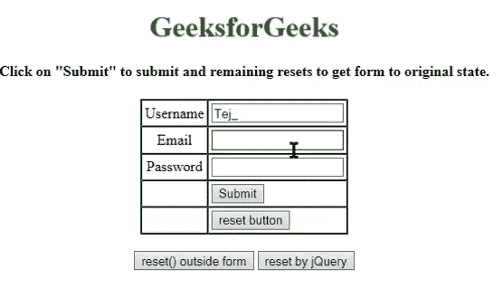

# 如何使用带有的 jQuery 重置表单。reset()方法？

> 原文:[https://www . geeksforgeeks . org/如何使用带有重置方法的 jquery 重置表单/](https://www.geeksforgeeks.org/how-to-reset-a-form-using-jquery-with-reset-method/)



重置会将任何内容恢复到其原始状态。JQuery 没有 reset()方法，但是原生 JavaScript 有。因此，我们将 jQuery 元素转换成一个 JavaScript 对象。

JavaScript reset():Reset()方法重置表单中所有元素的值(与单击 Reset 按钮相同)。

**Syntax for JavaScript reset button:**

*   ```
    // type-1
    <input type="reset">

    ```

    *   ```
    // type-2
    <input type="button" onclick="this.form.reset();">
    ```

    *   ```
    // type-3
    <input type="button" onclick="formname.reset();">
    ```

    按钮本身会重置表单，但是对于 type-1 和 type-2，重置按钮应该在表单内部，type-3 可以是 out 也可以是 in。
    但复位按钮是一个好得多的选择。(类型 1)

    *   ```
        <input type="reset">
        ```

    *   reset()的语法:

        ```
        formObject.reset()
        ```

    *   Syntax to convert jQuery element to a JavaScript object.

        ```
        $(selector)[0].reset()
        ```

        或者

        ```
        $(selector).get(0).reset()
        ```

    如果我们不想将 jQuery 元素转换成 JavaScript 对象，那么我们可以使用 [**触发器()**](https://www.geeksforgeeks.org/jquery-trigger-method/) 。

    > 作为**触发器()**方法为所选元素触发指定的事件和事件的默认行为(如表单提交)。
    > **语法**
    > 
    > ```
    > $(selector).trigger(event, eventObj, ...)
    > ```

    **示例:**

    ```
    <!DOCTYPE html>
    <html>

    <head>
        <title>Try jQuery Online</title>
        <script src=
    "https://ajax.googleapis.com/ajax/libs/jquery/3.4.1/jquery.min.js">
      </script>
        <script>
            $(document).ready(function() {
                $("button").click(function() {
                    //$("#d").trigger("reset");
                    //$("#d").get(0).reset();
                    $("#d")[0].reset()
                });
            });
        </script>
    </head>

    <body>
        <center>
            <h1 style="color:green">GeeksforGeeks</h1>
            <h4> 
            Click on "Submit" to submit and 
              remaining resets to get form to original state. 
            </h4>
            <form id="d" action="/cgi-bin/test.cgi" name="geek">
                <table cellspacing="0" cellpadding="3" border="1">
                    <tr>
                        <td align="center">Username</td>
                        <td>
                            <input type="text" name="name" />
                        </td>
                    </tr>
                    <tr>
                        <td align="center">Email</td>
                        <td>
                            <input type="text" name="name" />
                        </td>
                    </tr>
                    <tr>
                        <td align="center">Password</td>
                        <td>
                            <input type="password" />
                        </td>
                    </tr>
                    <tr>
                        <td align="center"></td>
                        <td>
                            <input type="submit" value="Submit" />
                        </td>
                    </tr>
                    <tr>
                        <td align="center"></td>
                        <td>
                            <input type="reset" value="reset button" />
                        </td>
                    </tr>
                </table>
            </form>
            <br>
            <input type="button" 
                   value="reset() outside form" 
                   onclick="geek.reset();" />
            <button>resetby jQuery</button>
        </center>
    </body>

    </html>
    ```

    **输出**T2】

    <video class="wp-video-shortcode" id="video-357041-1" width="612" height="322" autoplay="" preload="metadata" controls=""><source type="video/mp4" src="https://media.geeksforgeeks.org/wp-content/uploads/20191103080522/reset.mp4?_=1">[https://media.geeksforgeeks.org/wp-content/uploads/20191103080522/reset.mp4](https://media.geeksforgeeks.org/wp-content/uploads/20191103080522/reset.mp4)</video>

    jQuery 是一个开源的 JavaScript 库，它简化了 HTML/CSS 文档之间的交互，它以其“少写多做”的理念而闻名。
    跟随本 [jQuery 教程](https://www.geeksforgeeks.org/jquery-tutorials/)和 [jQuery 示例](https://www.geeksforgeeks.org/jquery-examples/)可以从头开始学习 jQuery。