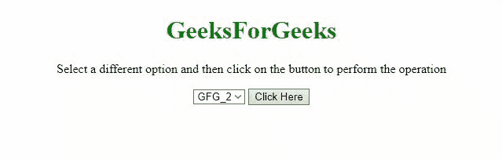

# 如何使用 jQuery 将选中的值重置为默认值？

> 原文:[https://www . geesforgeks . org/如何使用-jquery/](https://www.geeksforgeeks.org/how-to-reset-selected-value-to-default-using-jquery/) 将选定值重置为默认值

任务是在 jQuery 的帮助下将 select 元素的值重置为默认值。下面讨论两种方法:
**方法 1:** 首先使用 jQuery 选择器选择选项，然后使用 [**prop()方法**](https://www.geeksforgeeks.org/jquery-prop-with-examples/) 访问其属性。如果选择了属性，则使用**默认选择的属性**返回默认值。

*   **例:**

## 超文本标记语言

```html
<!DOCTYPE HTML>
<html>

<head>
    <title>
        Reset select value to
        default with JQuery
    </title>

    <script src=
"https://ajax.googleapis.com/ajax/libs/jquery/3.4.0/jquery.min.js">
    </script>
</head>

<body style="text-align:center;">

    <h1 style="color:green;">
        GeeksForGeeks
    </h1>

    <p id="GFG_UP"></p>

    <select id="select">
        <option value="GFG_1">GFG_1</option>
        <option value="GFG_2" selected="selected">
            GFG_2
        </option>
        <option value="GFG_3">GFG_3</option>
    </select>

    <button onclick="GFG_Fun()">
        Click Here
    </button>

    <p id="GFG_DOWN"></p>

    <script>
        var el_up = document.getElementById('GFG_UP');
        var el_down = document.getElementById('GFG_DOWN');
        el_up.innerHTML = "Select a different option "
                + "and then click on the button to "
                + "perform the operation";

        function GFG_Fun() {
            $('#select option').prop('selected', function () {
                return this.defaultSelected;
            });
            el_down.innerHTML = "Default selected";
        }
    </script>
</body>

</html>
```

*   **输出:**



**方法 2:** 首先，使用 jQuery 选择器选择选项，然后使用 [**各()方法**](https://www.geeksforgeeks.org/jquery-misc-each-method/) 访问其属性。如果选择了属性，则通过**默认选择属性**返回默认值。

*   **例:**

## 超文本标记语言

```html
<!DOCTYPE HTML>
<html>

<head>
    <title>
        Reset select value to
        default with JQuery
    </title>

    <script src=
"https://ajax.googleapis.com/ajax/libs/jquery/3.4.0/jquery.min.js">
    </script>
</head>

<body style="text-align:center;">

    <h1 style="color:green;">
        GeeksForGeeks
    </h1>

    <p id="GFG_UP"></p>

    <select id="select">
        <option value="GFG_1">GFG_1</option>
        <option value="GFG_2" selected="selected">
            GFG_2
        </option>
        <option value="GFG_3">GFG_3</option>
    </select>

    <button onclick="GFG_Fun()">
        Click Here
    </button>

    <p id="GFG_DOWN"></p>

    <script>
        var el_up = document.getElementById('GFG_UP');
        var el_down = document.getElementById('GFG_DOWN');
        el_up.innerHTML = "Select a different option "
                + "and then click on the button to "
                + "perform the operation";

        function GFG_Fun() {
            $('#select option').each(function () {
                if (this.defaultSelected) {
                    this.selected = true;
                    return false;
                }
            });
            el_down.innerHTML = "Default selected";
        }
    </script>
</body>

</html>
```

*   **输出:**


jQuery 是一个开源的 JavaScript 库，它简化了 HTML/CSS 文档之间的交互，它以其“少写多做”的理念而闻名。
跟随本 [jQuery 教程](https://www.geeksforgeeks.org/jquery-tutorials/)和 [jQuery 示例](https://www.geeksforgeeks.org/jquery-examples/)可以从头开始学习 jQuery。