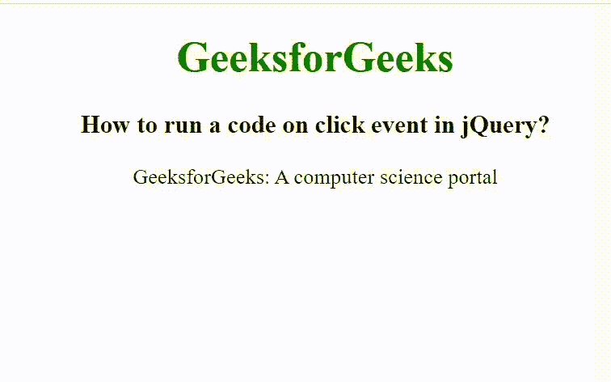

# 如何在 jQuery 中对点击事件运行代码？

> 原文:[https://www . geesforgeks . org/如何在 jquery 中运行代码点击事件/](https://www.geeksforgeeks.org/how-to-run-a-code-on-click-event-in-jquery/)

在本文中，我们将看到如何在点击一个[事件](https://www.geeksforgeeks.org/javascript-events/)后运行代码。要在单击事件后运行代码，我们使用[单击()](https://www.geeksforgeeks.org/html-dom-onclick-event/)方法。当点击事件发生时，使用 *click()* 方法运行代码。

**语法:**

```
$(selector).click(function);
```

**参数:**接受一个可选参数“function”，用于点击事件发生时运行。

**示例:**

## 超文本标记语言

```
<!DOCTYpe html>
<html>

<head>
    <title>
        How to run a code on
        click event in jQuery?
    </title>

    <script src=
    "https://ajax.googleapis.com/ajax/libs/jquery/3.3.1/jquery.min.js">
    </script>

    <!-- jQuery code to show the working 
        of this method -->
    <script>
        $(document).ready(function () {
               $("body").css("text-align", "center");
               $("h1").css("color", "green");
               $("p").click(function () {
               $(this).css("font-size", "20px");
               $(this).css("color", "green");
            });
        });
    </script>
</head>

<body>
    <h1>GeeksforGeeks</h1>

    <h3>
        How to run a code on click event in jQuery?
    </h3>

    <p onclick="alert('paragraph was clicked')">
        GeeksforGeeks: A computer science portal
    </p>

</body>

</html>
```

**输出:**



点击事件