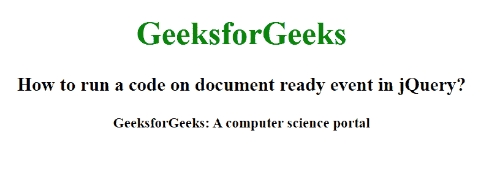

# 如何在 jQuery 中对文档就绪事件运行代码？

> 原文:[https://www . geeksforgeeks . org/如何在 jquery 中运行文档就绪事件代码/](https://www.geeksforgeeks.org/how-to-run-a-code-on-document-ready-event-in-jquery/)

在本文中，我们将看到如何在使用 jQuery 加载页面时运行代码。为了在页面加载时运行代码，我们将使用 ready()方法。这个方法有助于加载整个页面，然后执行剩余的代码。这个方法指定了当 DOM 完全加载时要执行的函数。

**语法:**

```html
$(document).ready(function)
```

**参数:**该方法接受单参数函数，该函数是强制的。它用于指定加载文档后运行的函数。

**返回值:**该方法执行 ready()方法后返回文档。

**示例:**

## 超文本标记语言

```html
<!DOCTYpe html>
<html>

<head>
    <title>
        How to run a code on document
        ready event in jQuery?
    </title>

    <script src=
"https://ajax.googleapis.com/ajax/libs/jquery/3.3.1/jquery.min.js">
    </script>

    <!-- jQuery code to show the working of this method -->
    <script>
        $(document).ready(function () {
            $("body").css("text-align", "center");
            $("h1").css("color", "green");
            $("p").css("font-size", "14px");
            $("p").css("font-weight", "bold");
        });
    </script>
</head>

<body>
    <h1>GeeksforGeeks</h1>

    <h3>
        How to run a code on document
        ready event in jQuery?
    </h3>

    <p>GeeksforGeeks: A computer science portal</p>
</body>

</html>
```

**输出:**

