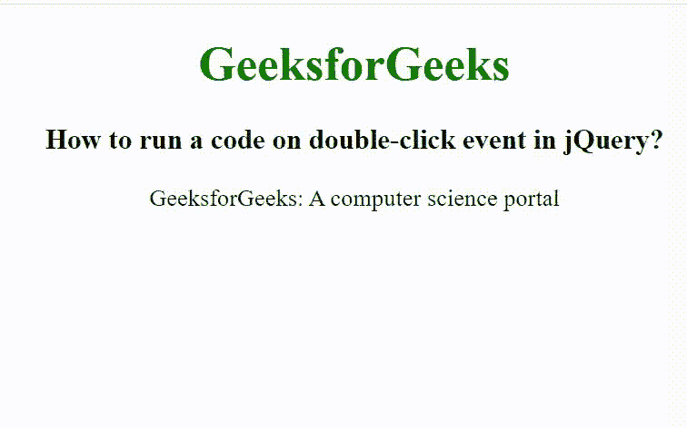

# 如何在 jQuery 中对双击事件运行代码？

> 原文:[https://www . geesforgeks . org/如何在 jquery 中运行代码双击事件/](https://www.geeksforgeeks.org/how-to-run-a-code-on-double-click-event-in-jquery/)

在本文中，我们将看到如何在使用 jQuery 双击元素后运行代码。要在双击时运行代码，我们使用 dblclick()方法。此方法用于触发双击事件的发生。当双击选定的元素时，会出现此方法。

**语法:**

```html
$(selector).dblclick(args);
```

**参数:**接受可选参数“args”，指定双击后执行特定任务的功能。

**示例:**

## 超文本标记语言

```html
<!DOCTYpe html>
<html>

<head>
    <title>
        How to run a code on double-click
        event in jQuery?
    </title>

    <script src=
"https://ajax.googleapis.com/ajax/libs/jquery/3.3.1/jquery.min.js">
    </script>

    <!-- jQuery code to show the working 
        of this method -->
    <script>
        $(document).ready(function () {
            $("body").css("text-align", "center");
            $("h1").css("color", "green");
            $("p").dblclick(function () {
                $(this).css("font-size", "20px");
                $(this).css("color", "green");
            });
        });
    </script>
</head>

<body>
    <h1>GeeksforGeeks</h1>

    <h3>
        How to run a code on double-click
        event in jQuery?
    </h3>

    <p>
        GeeksforGeeks: A computer science portal
    </p>

</body>

</html>
```

**输出:**

