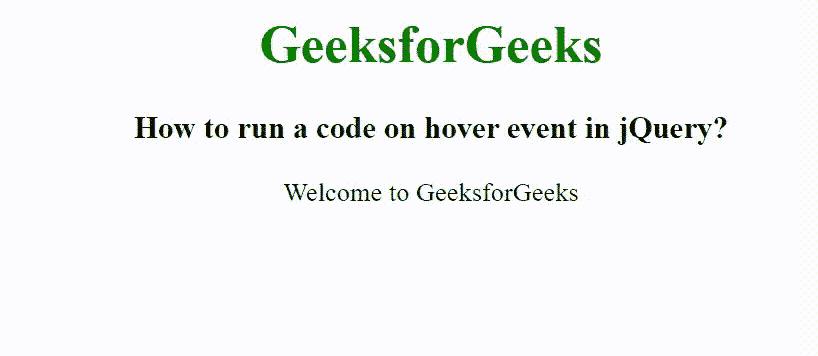

# 如何在 jQuery 中对悬停事件运行代码？

> 原文:[https://www . geesforgeks . org/how-to-run-a-code-on-hover-event-in-jquery/](https://www.geeksforgeeks.org/how-to-run-a-code-on-hover-event-in-jquery/)

在本文中，我们将看到如何使用 jQuery 更改悬停事件中元素的样式。若要更改悬停事件的样式，请使用 hover()方法。hover()方法用于指定当鼠标指针在选定元素上移动时启动的两个函数。

**语法:**

```
$(selector).hover(Function_in, Function_out);
```

**参数:**接受以下指定的两个参数-

*   **Function_in:** 指定鼠标移动事件发生时要运行的功能。
*   **Function_out:** 可选，指定鼠标移出事件发生时要运行的功能。

这里，我们已经创建了一个段落元素，当鼠标移动到段落元素上时，元素的样式将会改变。

**示例:**

## 超文本标记语言

```
<!DOCTYpe html>
<html>

<head>
    <title>
        How to run a code on hover
        event in jQuery?
    </title>

    <script src=
"https://ajax.googleapis.com/ajax/libs/jquery/3.3.1/jquery.min.js">
    </script>

    <script>
        $(document).ready(function () {
            $(document).ready(function () {
                $("p").hover(function () {
                    $(this).css({
                        backgroundColor: "green",
                        fontSize: "30px",
                        color: "white"
                    });
                }, function () {
                    $(this).css("background-color", "yellow");
                });
            });
        });
    </script>
</head>

<body style="text-align: center;">
    <h1 style="color: green;">
        GeeksforGeeks
    </h1>

    <h3>
        How to run a code on hover event in jQuery?
    </h3>

    <p>Welcome to GeeksforGeeks</p>

</body>

</html>
```

**输出:**

