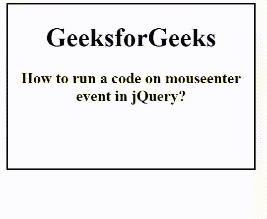

# 如何在 jQuery 中的 mouseenter 事件上运行代码？

> 原文:[https://www . geesforgeks . org/how-to-run-a-code-on-mouse enter-event-in-jquery/](https://www.geeksforgeeks.org/how-to-run-a-code-on-mouseenter-event-in-jquery/)

在本文中，我们将看到如何使用 jQuery 在鼠标进入特定区域时运行代码。要在鼠标上运行代码进入特定区域，使用 [mouseenter()方法](https://www.geeksforgeeks.org/jquery-mouseenter-with-examples/)。当鼠标指针移动到选定的元素上时，mouseenter()方法工作。

**语法:**

```
$(selector).mouseenter(function)
```

**参数:**该方法接受单参数函数，可选。它用于指定调用 mouseenter()方法时要运行的函数。

**示例:**

## 超文本标记语言

```
<!DOCTYPE html>
<html>

<head>
    <title>
        How to run a code on mouseenter
        event in jQuery?
    </title>

    <script src=
"https://ajax.googleapis.com/ajax/libs/jquery/3.3.1/jquery.min.js">
    </script>

    <script>
        $(document).ready(function () {
            $(".main").mouseenter(function () {
                $(".main").css({
                    background: "green",
                    color: "white"
                });
            });
        });
    </script>

    <style>
        body {
            text-align: center;
        }

        .main {
            width: 300px;
            height: 200px;
            border: 2px solid black;
        }
    </style>
</head>

<body>
    <div class="main">
        <h1>GeeksforGeeks</h1>

        <h3>
            How to run a code on mouseenter
            event in jQuery?
        </h3>
    </div>
</body>

</html>
```

**输出:**

