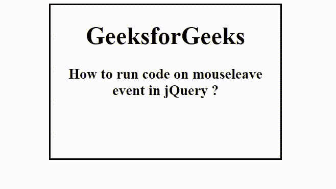

# 如何在 jQuery 中的 mouseleave 事件上运行代码？

> 原文:[https://www . geesforgeks . org/how-run-code-on-mouseleave-event-in-jquery/](https://www.geeksforgeeks.org/how-to-run-code-on-mouseleave-event-in-jquery/)

在本文中，我们将看到如何使用 jQuery 在鼠标离开特定区域时运行代码。要将鼠标左键上的代码运行到特定区域，需要使用 [**鼠标左键()方法**](https://www.geeksforgeeks.org/jquery-mouseleave-with-examples/) 。当鼠标指针离开选定的元素时，mouseleave()方法工作。

**语法:**

```html
$(selector).mouseleave(function)
```

**参数:**该方法接受单参数函数，该函数是可选的。它用于指定调用 mouseleave 事件时要运行的函数。

**示例:**

## 超文本标记语言

```html
<!DOCTYPE html>
<html>

<head>
    <title>
        How to run code on mouseleave 
        event in jQuery ?
    </title>

    <script src=
"https://ajax.googleapis.com/ajax/libs/jquery/3.3.1/jquery.min.js">
    </script>

    <script>
        $(document).ready(function() {
            $(".main").mouseleave(function() {
                $(".main").css({
                    background: "green",
                    color: "white"
                });
            });
            $(".main").mouseenter(function() {
                $(".main").css({
                    background: "none",
                    color: "black"
                });
            });
        });
    </script>

    <style>
        .main {
            width: 300px;
            height: 200px;
            border: 2px solid black;
        }
    </style>
</head>

<body>
    <center>
        <div class="main">
            <h1>GeeksforGeeks</h1>

            <h3>
                How to run code on mouseleave 
                event in jQuery ?
            </h3>
        </div>
    </center>
</body>

</html>
```

**输出:**

