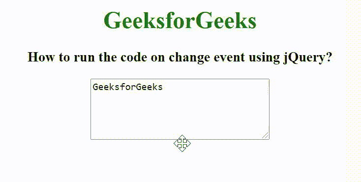

# 如何使用 jQuery 在变更事件上运行代码？

> 原文:[https://www . geeksforgeeks . org/如何使用-jquery/](https://www.geeksforgeeks.org/how-to-run-the-code-on-change-event-using-jquery/) 运行变更事件代码

在本文中，我们将看到如何使用 jQuery 在变更事件上运行代码。change 事件用于在用户更改元素的值时触发。

**语法:**

```html
$(selector).change(function)
```

在下面的例子中，我们创建了一个包含 GeeksforGeeks 文本的 textarea 元素。当用户更改 textarea 内容并将光标从 textarea 中移除时，将触发更改事件，并在 textarea 元素上添加样式。

**示例:**

## 超文本标记语言

```html
<!DOCTYPE html>
<html>

<head>
    <title>
        How to run the code on change 
        event using jQuery?
    </title>

    <script src=
"https://ajax.googleapis.com/ajax/libs/jquery/3.3.1/jquery.min.js">
    </script>

    <script>
        $(document).ready(function() {
            $("textarea").change(function() {
                $("textarea").css({
                    background: "green",
                    color: "white"
                });
            });
        });
    </script>
</head>

<body>
    <center>
        <h1 style="color: green;">
            GeeksforGeeks
        </h1>

        <h3>
            How to run the code on change 
            event using jQuery?
        </h3>

        <textarea rows="5" cols="30">GeeksforGeeks
        </textarea>
    </center>
</body>

</html>
```

**输出:**

