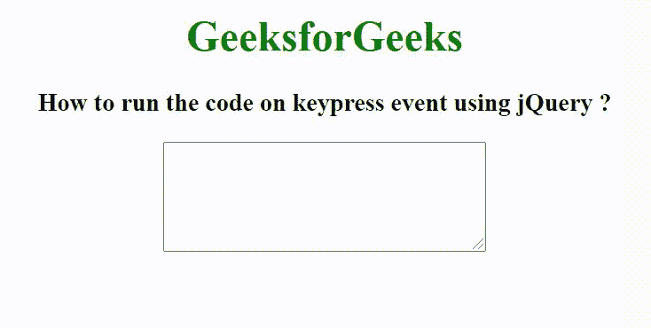

# 如何使用 jQuery 在按键事件上运行代码？

> 原文:[https://www . geeksforgeeks . org/如何使用-jquery/](https://www.geeksforgeeks.org/how-to-run-the-code-on-keypress-event-using-jquery/) 运行按键代码事件

在本文中，我们将看到如何使用 [jQuery](https://www.geeksforgeeks.org/jquery-tutorials/) 在 keypress 事件上运行代码片段。当用户按下键盘按钮时，按键事件被触发。

**语法:**

```html
$(selector).keypress()
```

在下面的例子中，我们正在创建一个 textarea 元素，当用户开始按键在 textarea 上写一些内容时，按键事件被触发。当此事件被触发时，CSS 样式被添加到元素中。

**示例:**

## 超文本标记语言

```html
<!DOCTYPE html>
<html>

<head>
    <title>
          How to run the code on keypress 
          event using jQuery ?
      </title>

    <script src=
"https://ajax.googleapis.com/ajax/libs/jquery/3.3.1/jquery.min.js">
      </script>

    <script>
        $(document).ready(function () {
            $("textarea").keypress(function () {
                $("textarea").css({
                    background: "green",
                    color: "white",
                });
            });
        });
    </script>
</head>

<body>
    <center>
        <h1 style="color: green">GeeksforGeeks</h1>
        <h3>
          How to run the code on keypress 
          event using jQuery ?
          </h3>
        <textarea rows="5" cols="30"></textarea>
    </center>
</body>

</html>
```

**输出:**

