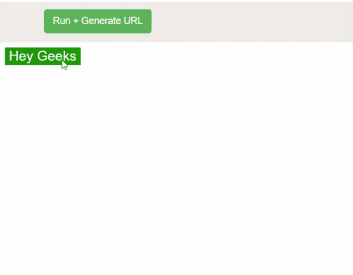
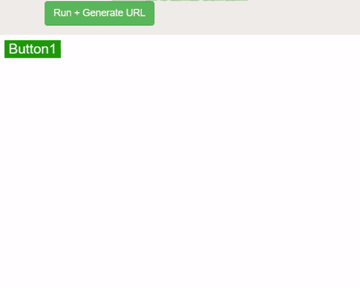

# 如何在 jQuery 中同时运行两个动画？

> 原文:[https://www . geesforgeks . org/如何在 jquery 中同时运行两个动画/](https://www.geeksforgeeks.org/how-to-run-two-animations-simultaneously-in-jquery/)

**[。动画()](https://www.geeksforgeeks.org/jquery-animate-with-examples/)**jQuery**中的**方法用于处理效果和动画。具有数值的属性*可以通过这种方法设置动画，如宽度、高度、边框宽度等。但是，属性名称应该是**驼色的**(例如 borderWidth)。通常，如果不同的动画被**链接到同一个 html 元素上**，则 **jQuery 会将它们添加到一个队列中，并按顺序执行它们**。在本文中，我们将讨论如何同时制作这样的动画。animate()方法将仅在页面上发生事件(正在收听)后触发。对于两个不同的 HTML 元素，在触发事件时，动画将同时发生。*

根据官方的 jQuery 文档。animate()方法提供了两个原型:

*   ***。animate( properties，[ duration ]，[ easing ]，[ complete ] ):*** Properties 是 css 属性的普通 javascript 对象，后面是一个整数、一个字符串和一个布尔值，其余的都是。
*   ***。动画(属性，选项):*** 属性和选项都是普通的 javascript 对象。options 对象可以通过一个可选的“队列”属性传递，该属性允许我们选择是否将链接动画添加到队列中。出于这个例子的目的，我们将使用第二个原型。

下面的代码演示了链接动画的样子:

```html
<!DOCTYPE html>
<html lang="en">

<head>
    <meta charset="UTF-8">
    <meta name="viewport" content="width=device-width, initial-scale=1.0">
    <script
    src="https://code.jquery.com/jquery-3.4.1.min.js"
    integrity="sha256-CSXorXvZcTkaix6Yvo6HppcZGetbYMGWSFlBw8HfCJo="
    crossorigin="anonymous">
    </script>
    <title>Document</title>
</head>

<body>
    <div class="button">
        <button id="bt1">Hey Geeks</button>
    </div>
    <style>
        button{
            background-color: rgb(31, 156, 0);
            border: none;
            color: white;
            font-size: 20px;
        }
    </style>

    <script type="text/javascript">
        $(document).ready( ()=>{

            // Event listener to recognise click
            // Animations will occur sequentially
            // and will be added to queue
            $('#bt1').on('click', () => {
                $('#bt1').animate({fontSize : '40px'}, {duration : 1000})
                .animate({width : '300px'}, {duration : 1000})
                .animate({height : '300px' }, {duration : 1000});
            });
        });
    </script>
</body>

</html>
```

在上面的例子中，我们已经将三个动画链接到了 HTML 按钮元素。动画在点击时触发。以下代码集也会发生同样的情况:

```html
$(document).ready( ()=>{

    // Event listener to listen for click
    // Animations will be added to queue
    // and occur sequentially
    $('#bt1').on('click', () => {
        $('#bt1').animate({fontSize : '30px'}, {duration : 1000})
        $('#bt1').animate({width : '300px'}, {duration : 1000})
        $('#bt1').animate({height : '300px' }, {duration : 1000});
    });
});
```

**输出:**


我们可以通过两种方式同时触发动画。

**方法 1:在选项**中使用“QUEUE”属性

```html
<!DOCTYPE html>
<html lang="en">

<head>
    <meta charset="UTF-8">
    <meta name="viewport" 
          content="width=device-width,
                   initial-scale=1.0">
    <script src=
"https://code.jquery.com/jquery-3.4.1.min.js"
    integrity=
"sha256-CSXorXvZcTkaix6Yvo6HppcZGetbYMGWSFlBw8HfCJo="
    crossorigin="anonymous">
    </script>
    <title>Document</title>
</head>

<body>
    <div class="button">
        <button id="bt1">Button1</button>
    </div>
    <style>
        button{
            background-color: rgb(31, 156, 0);
            border: none;
            color: white;
            font-size: 20px;
        }
    </style>
    <script type="text/javascript">
        $(document).ready( ()=>{

            /* Animations will not be added to queue
               and hence occur simultaneously*/
            $('#bt1').on('click', () => {
                $('#bt1').animate({fontSize : '60px'}, 
                    {duration : 1000, queue : false})
                .animate({width : '300px'},
                 {duration : 1000, queue : false})
                .animate({height : '300px' }, 
                 {duration : 1000, queue : false});
            });
        });
    </script>
</body>

</html>
```

**输出:**


通过传递选项 **`queue : false`** ，我们确保动画不会**被添加到队列**中。 **jQuery 中默认的动画队列叫做 fx** 。当您希望某些动画同时发生，某些动画顺序发生，并且代码可读性更好时，上述方法特别有用。默认情况下，**队列为真**。

**方法 2:** 在一个对象中传递所有 css 属性

```html
<!DOCTYPE html>
<html lang="en">

<head>
    <meta charset="UTF-8">
    <meta name="viewport" 
                content="width=device-width,
                initial-scale=1.0">
    <script src=
"https://code.jquery.com/jquery-3.4.1.min.js"
    integrity=
"sha256-CSXorXvZcTkaix6Yvo6HppcZGetbYMGWSFlBw8HfCJo="
    crossorigin="anonymous">
    </script>
    <title>Document</title>
</head>

<body>
    <div class="button">
        <button id="bt1">Button1</button>
    </div>
    <style>
        button{
            background-color: rgb(31, 156, 0);
            border: none;
            color: white;
            font-size: 20px;
        }
    </style>
    <script type="text/javascript">
        $(document).ready( ()=>{

            /* All the animations have been passed
               as a single object and hence will
               occur simultaneously*/
            $('#bt1').on('click', () => {
                $('#bt1').animate({
                     fontSize : '60px',
                     width : '300px',
                     height : '300px'
                },
                {duration : 1000})
                });
        });
    </script>
</body>

</html>
```

**输出:**


通过以上两种方法，在 jQuery 中实现两个或更多动画的任务可以同时实现，而不是将它们放在队列中并顺序执行。