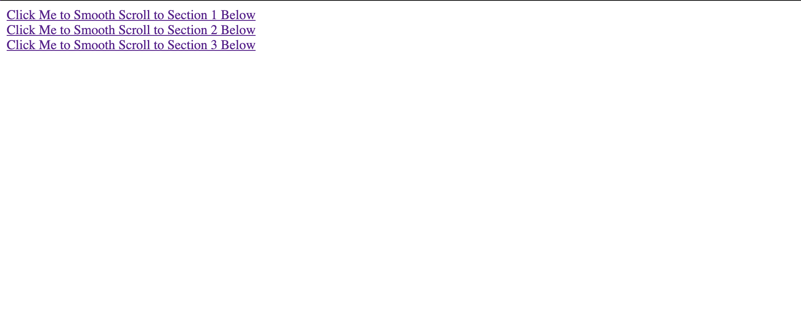
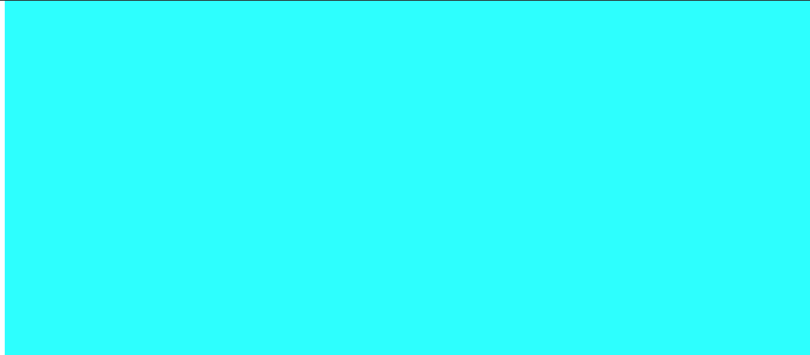

# 如何在 jQuery 中使用锚点元素上下滚动页面？

> 原文:[https://www . geesforgeks . org/如何使用 jquery 中的锚元素向上或向下滚动页面/](https://www.geeksforgeeks.org/how-to-scroll-the-page-up-or-down-using-anchor-element-in-jquery/)

问题是，每当我们单击一个本地锚点，并希望相应地向上或向下滚动页面时，都会包含一个幻灯片效果。早些时候，我们可以通过使用 CSS 属性来实现它。

**语法:**

```html
a {
  scroll-behavior: smooth;
}

```

现在在 jQuery 的帮助下，我们可以通过使用以下两种方法来实现:

*   **jQuery.offset()方法:**这个方法允许我们检索任何元素相对于文档的当前位置。当我们想要执行拖放操作或者想要将新元素放置在另一个现有元素的顶部时，这个方法特别有用。
*   **jQuery.animate()方法:**该方法允许在任何数值 CSS 属性上创建动画。使用方法需要 CSS 对象。我们可以用它来制作样式和非样式属性的动画。

**示例:**

```html
<!DOCTYPE html>
<html>

<head>
    <title>
        How to scroll the page up or down
        using anchor element in jQuery ?
    </title>

    <script src=
"https://ajax.googleapis.com/ajax/libs/jquery/3.4.1/jquery.min.js">
    </script>

    <script>
        $(document).ready(function () {

            // Add smooth scrolling to all links
            $("a").on('click', function (event) {

                // Make sure this.hash has a value
                // before overriding default behavior
                if (this.hash !== "") {

                    // Prevent default anchor
                    // click behavior
                    event.preventDefault();

                    // Store hash
                    var hash = this.hash;

                    // Using jQuery's animate() method 
                    // to add smooth page scroll
                    // The optional number (800) specifies
                    // the number of milliseconds it takes
                    // to scroll to the specified area
                    $('html, body').animate({
                        scrollTop: $(hash).offset().top
                    }, 500, function () {

                        // Add hash (#) to URL when done 
                        // scrolling (default click behavior)
                        window.location.hash = hash;
                    });
                } // End if
            });
        });
    </script>

    <style>
        body,
        html, .primary {
            height: 150%;
        }

        section {
            min-height: 150%;
        }
    </style>
</head>

<body>
    <div>
        <a href="#section1">
            Click Me to Smooth Scroll
            to Section 1 Below
        </a>
    </div>
    <div>
        <a href="#section2">
            Click Me to Smooth Scroll
            to Section 2 Below
        </a>
    </div>
    <div>
        <a href="#section3">
            Click Me to Smooth Scroll
            to Section 3 Below
        </a>
    </div>

    <div class="primary">
        <section></section>
    </div>

    <div class="primary" id="section1">
        <section style="background-color:cyan"></section>
    </div>

    <div class="primary" id="section2">
        <section style="background-color:yellow"></section>
    </div>

    <div class="primary" id="section3">
        <section style="background-color:red"></section>
    </div>
</body>

</html>
```

**输出:**

*   **第一节滚动效果前:**
    
*   **在第 1 部分滚动效果后，我们进入青色框，如代码:**
    