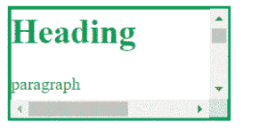
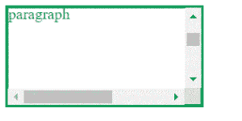
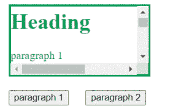
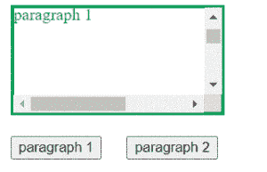
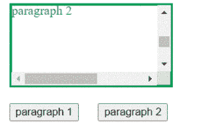

# 如何使用 jQuery 滚动到特定元素？

> 原文:[https://www . geeksforgeeks . org/如何使用-jquery/](https://www.geeksforgeeks.org/how-to-scroll-to-specific-element-using-jquery/) 滚动到特定元素

很多时候，在我们的网站中，当我们点击导航栏或列表中的按钮或标题时，我们希望自动滚动到网页的某个部分。所以，要实现这种自动滚动到需要的元素，我们需要借助 **jQuery** 。使用 jQuery，我们可以用一种非常简单的方式实现这一点。但是首先我们需要了解两种方法，即 jQuery 中的 **scrollTop()** 和 **offSet()** 。

**scrollTop()方法:**它有助于获取第一个元素的滚动条在所有匹配元素集中的当前垂直位置。

**scrollTop()方法:**用于将滚动条的垂直位置设置为值‘val’。

**offSet()方法:**用于获取所有匹配元素集合中第一个元素的坐标。

**示例 1:** 本示例描述了如何使用 jQuery 滚动特定元素。

```html
<!DOCTYPE html>
<html lang="en">

<head>
    <meta charset="UTF-8">
    <meta name="viewport" content=
        "width=device-width, initial-scale=1.0">

    <script src=
"https://code.jquery.com/jquery-3.5.1.min.js"
        integrity=
"sha256-9/aliU8dGd2tb6OSsuzixeV4y/faTqgFtohetphbbj0="
        crossorigin="anonymous">
    </script>

    <title>
        How to scroll to specific 
        item using jQuery?
    </title>

    <style>
        div {
            color: #0f9d58;
            border: 3px solid #0f9d58;
            width: 200px;
            height: 100px;
            overflow: auto;
        }

        p {
            width: 300px;
            height: 300px;
        }
    </style>
</head>

<body>
    <div class="demo">
        <h1>Heading</h1>
        <p>paragraph</p>
    </div>

    <script>
        var container = $('div');
        var scrollTo = $('p');

        // Calculating new position of scrollbar
        var position = scrollTo.offset().top 
                - container.offset().top 
                + container.scrollTop();

        // Setting the value of scrollbar
        container.scrollTop(position);
    </script>
</body>

</html>
```

**输出:**



**示例 2:** 在本例中，我们将看到如何通过单击不同的按钮滚动到页面的不同部分，以及滚动效果。

```html
<!DOCTYPE html>
<html lang="en">

<head>
    <meta charset="UTF-8">
    <meta name="viewport" content=
        "width=device-width, initial-scale=1.0">

    <script src=
"https://code.jquery.com/jquery-3.5.1.min.js"
        integrity=
"sha256-9/aliU8dGd2tb6OSsuzixeV4y/faTqgFtohetphbbj0="
        crossorigin="anonymous">
    </script>

    <title>
        How to scroll to specific 
        item using jQuery?
    </title>

    <style>
        div {
            color: #0f9d58;
            border: 3px solid #0f9d58;
            margin: 10px;
            width: 200px;
            height: 100px;
            overflow: auto;
        }

        p {
            width: 300px;
            height: 300px;
        }

        button {
            margin: 10px;
        }
    </style>
</head>

<body>
    <div class="demo">
        <h1>Heading</h1>
        <p id="p1">paragraph 1</p>
        <p id="p2">paragraph 2</p>
    </div>

    <button onclick="scrollParagraph1()">
        paragraph 1
    </button>

    <button onclick="scrollParagraph2()">
        paragraph 2
    </button>

    <script>
        var container = $('div');

        // Scrolls to paragraph 1
        function scrollParagraph1() {
            var scrollTo = $("#p1");

            // Calculating new position
            // of scrollbar
            var position = scrollTo.offset().top 
                - container.offset().top 
                + container.scrollTop();

            // Animating scrolling effect
            container.animate({
                scrollTop: position
            });
        }

        // Scrolls to paragraph 2
        function scrollParagraph2() {
            var scrollTo = $("#p2");

            // Calculating new position 
            // of scrollbar
            var position = scrollTo.offset().top 
                - container.offset().top 
                + container.scrollTop();

            // Animating scrolling effect
            container.animate({
                scrollTop: position
            });
        }
    </script>
</body>

</html>
```

**输出:**



单击第二个按钮时，输出如下。



jQuery 是一个开源的 JavaScript 库，它简化了 HTML/CSS 文档之间的交互，它以其“少写多做”的理念而闻名。
跟随本 [jQuery 教程](https://www.geeksforgeeks.org/jquery-tutorials/)和 [jQuery 示例](https://www.geeksforgeeks.org/jquery-examples/)可以从头开始学习 jQuery。