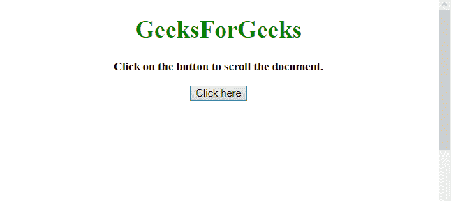
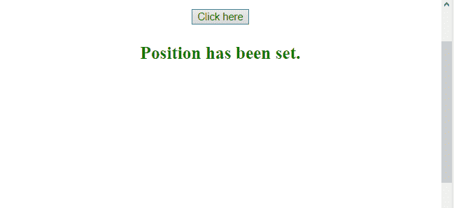

# 如何使用 jQuery 滚动窗口？

> 原文:[https://www . geesforgeks . org/如何使用-jquery 滚动窗口/](https://www.geeksforgeeks.org/how-to-scroll-window-using-jquery/)

给定一个 HTML 文档，任务是在 jQuery 的帮助下滚动文档。滚动 HTML 文档窗口有两种方法，下面将讨论:

**进场:**

*   使用选择器选择文档。
*   使用 **scrollTop()或 scrollTo()方法**将文档移动到该位置。

**示例 1:** 本示例使用 **scrollTop()方法**滚动 HTML 文档。

```
<!DOCTYPE HTML>  
<html>  

<head> 
    <title> 
        How to scroll window using jQuery ?
    </title>

    <script src=
"https://ajax.googleapis.com/ajax/libs/jquery/3.4.1/jquery.min.js">
    </script>

    <style>
        #body {
            height: 1000px;
        }
    </style>
</head> 

<body style = "text-align:center;" id = "body">  

    <h1 id = "h1" style = "color:green;" >  
        GeeksForGeeks  
    </h1>

    <p id = "GFG_UP" style =
        "font-size: 15px; font-weight: bold;">
    </p>

    <button onclick = "gfg_Run()"> 
        Click here
    </button>

    <p id = "GFG_DOWN" style = 
        "font-size: 23px; font-weight: bold; color: green; ">
    </p>

    <script>
        var el_up = document.getElementById("GFG_UP");
        var el_down = document.getElementById("GFG_DOWN");

        el_up.innerHTML = "Click on the button to scroll"
                        + " the document.";

        function gfg_Run() {
            $(document).scrollTop(100);
            el_down.innerHTML = "Position has been set.";
        }         
    </script> 
</body>  

</html>
```

**输出:**

*   **点击按钮前:**
    
*   **点击按钮后:**
    

**示例 2:** 本示例使用 **scrollTo()方法**滚动 HTML 文档。

```
<!DOCTYPE HTML>  
<html>  

<head> 
    <title> 
        How to scroll window using jQuery ?
    </title>

    <script src=
"https://ajax.googleapis.com/ajax/libs/jquery/3.4.1/jquery.min.js">
    </script>

    <style>
        #body {
            height: 1000px;
        }
    </style>
</head> 

<body style = "text-align:center;" id = "body">  

    <h1 id = "h1" style = "color:green;" >  
        GeeksForGeeks  
    </h1>

    <p id = "GFG_UP" style =
        "font-size: 15px; font-weight: bold;">
    </p>

    <button onclick = "gfg_Run()"> 
        Click here
    </button>

    <p id = "GFG_DOWN" style = 
        "font-size: 23px; font-weight: bold; color: green; ">
    </p>

    <script>
        var el_up = document.getElementById("GFG_UP");
        var el_down = document.getElementById("GFG_DOWN");

        el_up.innerHTML = "Click on the button to scroll"
                        + " the document.";

        function gfg_Run() {
            window.scrollTo(0, 100);
            el_down.innerHTML = "Position has been set.";
        }         
    </script> 
</body>  

</html>
```

**输出:**

*   **点击按钮前:**
    
*   **点击按钮后:**
    