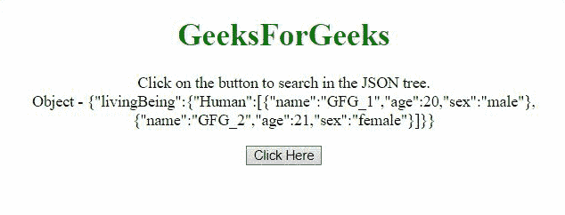

# 如何借助 jQuery 搜索 JSON 树？

> 原文:[https://www . geesforgeks . org/how-search-JSON-tree-借助 jquery/](https://www.geeksforgeeks.org/how-to-search-json-tree-with-the-help-of-jquery/)

给定一个 **JSON 对象的树**，任务是找到一条特定的信息。假设我们想在那个物体中找到关于一个特定的人的信息，那么我们怎么做呢？下面讨论两种方法:

**方法 1:** 在这种方法中，我们将使用**每()**方法，并通过使用**点运算符**将对象的真实数组传递给该方法，然后在匿名函数中通过比较其名称找到该人。

**示例:**

## 超文本标记语言

```html
<!DOCTYPE HTML>
<html>

<head>
    <script src=
"https://code.jquery.com/jquery-3.5.0.js">
    </script>
</head>

<body style="text-align:center;">

    <h1 style="color: green">
        GeeksForGeeks
    </h1>

    <p id="GFG_UP"></p>

    <button onclick="gfg_Run()">
        Click Here
    </button>

    <p id="GFG_DOWN"></p>

    <script>
        var elUp = document.getElementById("GFG_UP");
        var elDown = document.getElementById("GFG_DOWN");

        var GFG_Object = {
            "livingBeing": {
                "Human": [
                    {
                        "name": "GFG_1",
                        "age": 20,
                        "sex": "male"
                    }, {
                        "name": "GFG_2",
                        "age": 21,
                        "sex": "female"
                    }
                ]
            }
        };

        elUp.innerHTML =
            "Click on the button to search in"
            + " the JSON tree.<br>Object - "
            + JSON.stringify(GFG_Object);

        function gfg_Run() {
            $.each(GFG_Object.livingBeing.Human, 
                function (i, v) {

                if (v.name == "GFG_1") {
                    elDown.innerHTML = 
                        "The age of person('GFG_1') is  "
                        + v.age;
                    return;
                }
            });
        }   
    </script>
</body>

</html>
```

**输出:**



**方法 2:** 在这种方法中，我们将使用 **grep()** 方法，并通过使用**点运算符**将对象的实际数组传递给该方法，然后返回符合条件的对象，然后我们打印该人的年龄。

**示例:**

## 超文本标记语言

```html
<!DOCTYPE HTML>
<html>

<head>
    <script src=
"https://code.jquery.com/jquery-3.5.0.js">
    </script>
</head>

<body style="text-align:center;">

    <h1 style="color: green">
        GeeksForGeeks
    </h1>

    <p id="GFG_UP"></p>

    <button onclick="gfg_Run()">
        Click Here
    </button>

    <p id="GFG_DOWN"></p>

    <script>
        var elUp = document.getElementById("GFG_UP");
        var elDown = document.getElementById("GFG_DOWN");
        var GFG_Object = {
            "livingBeing": {
                "Human": [
                    {
                        "name": "GFG_1",
                        "age": 20,
                        "sex": "male"
                    }, {
                        "name": "GFG_2",
                        "age": 21,
                        "sex": "female"
                    }
                ]
            }
        };
        elUp.innerHTML
            = "Click on the button to search in"
            + " the JSON tree.<br>Object - "
            + JSON.stringify(GFG_Object);

        function gfg_Run() {
            var res
                = $.grep(GFG_Object.livingBeing.Human, 
                function (element, index) {
                    return (element.name === 'GFG_1');
                });
            elDown.innerHTML = 
                "The age of person('GFG_1') is " 
                + res[0].age;
        }   
    </script>
</body>

</html>
```

**输出:**

