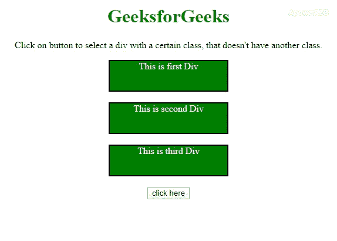

# 如何使用 jQuery 选择某个类的 div？

> 原文:[https://www . geeksforgeeks . org/如何使用-jquery/](https://www.geeksforgeeks.org/how-to-select-a-div-with-a-certain-class-using-jquery/) 选择特定类别的 div

给定一个包含许多带有类的 **div** 元素的 HTML 文档。这里的任务是选择一个有某个类的 div，它没有另一个类。有两种方法可以解决这个问题。在其中一个中，我们将使用一个方法，而在另一个中，我们将使用 not selector。

**方法 1:** 首先使用 jQuery Selector 选择某个类的 DIV，然后使用 **:not selector** 忽略特定类的元素。

*   **示例:**该示例实现了上述方法。

## 超文本标记语言

```html
<!DOCTYPE HTML>
<html>

<head>
    <title>
        Select a div with a certain class,
        that doesn't have another class.
    </title>
    <style>
        body {
            text-align: center;
        }

        h1 {
            color: green;
        }

        .div {
            background: green;
            height: 50px;
            width: 200px;
            margin: 0 auto;
            color: white;
            border: 2px solid black;
        }
    </style>
    <script src =
"https://ajax.googleapis.com/ajax/libs/jquery/3.4.0/jquery.min.js">
    </script>
</head>

<body>
    <h1>
        GeeksforGeeks
    </h1>

<p>
          Click on button to select a div with a certain
        class, that doesn't have another class.
    </p>

    <!-- div elements -->
    <div class="first div">
        This is first Div
    </div>
    <br>
    <div class="second div">
        This is second Div
    </div>
    <br>
    <div class="third div">
        This is third Div
    </div>
    <br>
    <button onClick="GFG_Fun()">
        click here
    </button>
    <br>
    <p id="geeks">
    </p>

    <script>

        /* main function */
        function GFG_Fun() {

            /* using the :not selector */
            $('.div:not(.first)')
            .css("background-color", "#173F5F");
            $('#geeks')
            .text("DIV Box of class 'first' is not selected.");
        }
    </script>
</body>

</html>
```

*   **输出:**



**方法二:**首先使用 jQuery 选择器选择某个类的 DIV，然后使用**。not()方法**忽略特定类的元素。

*   **示例:**该示例实现了上述方法。

## 超文本标记语言

```html
<!DOCTYPE HTML>
<html>

<head>
    <title>
        Select a div with a certain class,
        that doesn't have another class.
    </title>
    <style>
        body {
            text-align: center;
        }

        h1 {
            color: green;
        }

        .div {
            background: green;
            height: 50px;
            width: 200px;
            margin: 0 auto;
            color: white;
            border: 2px solid black;
        }
    </style>
    <script src =
"https://ajax.googleapis.com/ajax/libs/jquery/3.4.0/jquery.min.js">
    </script>
</head>

<body>
    <h1>
        GeeksforGeeks
    </h1>

<p>
        Click on button to select a div with a certain
        class, that doesn't have another class.
    </p>

    <!-- div elements -->
    <div class="first div">
        This is first Div
    </div>
    <br>
    <div class="second div">
        This is second Div
    </div>
    <br>
    <div class="third div">
        This is third Div
    </div>
    <br>
    <button onClick="GFG_Fun()">
        click here
    </button>
    <br>
    <p id="geeks">
    </p>

    <script>

        /* main function */
        function GFG_Fun() {

            /* using the .not() method */
            $('.div').not('.first')
            .css("background-color", "#173F5F");
            $('#GFG_DOWN')
            .text("DIV Box of class 'first' is not selected.");
        }
    </script>
</body>

</html>                   
```

*   **输出:**

