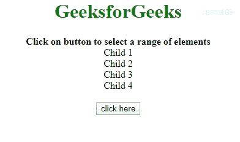

# 如何使用 jQuery 选择元素范围？

> 原文:[https://www . geeksforgeeks . org/如何使用-jquery 选择元素范围/](https://www.geeksforgeeks.org/how-to-select-a-range-of-elements-using-jquery/)

给定一个包含一系列相似元素的 HTML 文档，任务是在 JavaScript 的帮助下选择这些元素的范围。下面通过一个例子讨论了两种方法。

**方法 1:** 首先通过 jQuery 选择器选择 **class = 'child'** 的所有元素，然后使用 **[slice()方法](https://www.geeksforgeeks.org/javascript-array-slice/)** 连续选择一系列元素。元素的背景颜色已被更改以查看效果。

*   **例:**

    ```html
    <!DOCTYPE HTML>
    <html>

    <head>
        <title>
            How to select a range of elements in JQuery
        </title>
        <script src=
    "https://ajax.googleapis.com/ajax/libs/jquery/3.4.1/jquery.min.js">
        </script>
        <style>
            h1 {
                color: green;
            }

            .geeks {
                color: green;
                font-size: 24px;
                font-weight: bold;
            }
        </style>
    </head>

    <body>
        <center>
            <h1> 
              GeeksforGeeks 
            </h1>
            <b> 
              Click on button to select a range
              of elements
            </b>
            <div class="outer">
                <div class="child">
                  Child 1</div>
                <div class="child">
                  Child 2</div>
                <div class="child">
                  Child 3</div>
                <div class="child">
                  Child 4</div>
            </div>
            <br>
            <button onClick="gfg()">
                click here
            </button>
            <p id="geeks">
            </p>
        </center>
        <script>
            var down = document.getElementById('geeks');

            // Defining childs 
            var arr = [0, 2, 3];

            function gfg() {
                var $el = $(".outer .child");
                for (var i = 0; i < arr.length; i++) {
                    $el.slice(arr[i], arr[i] + 1)
                    .css("color", "red");
                }
                down.innerHTML = "Range of elements selected";
            }
        </script>
    </body>

    </html>
    ```

*   **输出:** 

**方法 2:** 首先通过 jQuery 选择器选择 **class = 'child'** 的所有元素。有一个数组包含要选择的元素的索引。我们遍历数组并使用 **[切片()方法](https://www.geeksforgeeks.org/javascript-array-slice/)** 选择该索引的特定元素。元素的背景颜色已被更改以查看效果。

*   **例:**

    ```html
    <!DOCTYPE HTML>
    <html>

    <head>
        <title>
            How to select a range of elements in JQuery
        </title>
        <script src=
    "https://ajax.googleapis.com/ajax/libs/jquery/3.4.1/jquery.min.js">
        </script>
        <style>
            h1 {
                color: green;
            }

            .geeks {
                color: green;
                font-size: 24px;
                font-weight: bold;
            }

        </style>
    </head>

    <body>
        <center>
            <h1> 
              GeeksforGeeks 
            </h1>
            <b> 
              Click on button to select a range
              of elements
            </b>
            <div class="outer">
                <div class="child">
                  Child 1</div>
                <div class="child">
                  Child 2</div>
                <div class="child">
                  Child 3</div>
                <div class="child">
                  Child 4</div>
            </div>
            <br>
            <button onClick="gfg()">
                click here
            </button>
            <p id="geeks">
            </p>
        </center>
        <script>
            var down = document.getElementById('geeks');

            // Defining childs 
            var arr = [0, 2, 3];

            function gfg() {
                var $el = $(".outer .child");
                for(var i=0; i<arr.length; i++) {
                   $el.slice(arr[i], arr[i]+1)
                   .css("color", "red");
                }
                down.innerHTML = "Range of elements selected";
            }
        </script>
    </body>

    </html>
    ```

*   **输出:** 