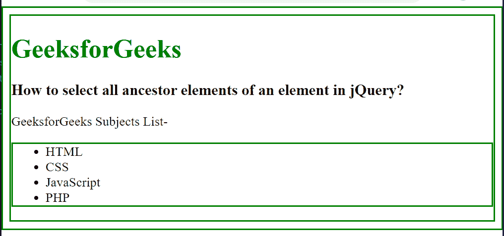

# 如何在 jQuery 中选择一个元素的所有祖先？

> 原文:[https://www . geeksforgeeks . org/如何选择 jquery 中元素的所有祖先/](https://www.geeksforgeeks.org/how-to-select-all-ancestors-of-an-element-in-jquery/)

在本文中，我们将选择 jQuery 中一个元素的所有祖先元素。要选择一个元素的所有祖先元素，需要使用 parents()方法。此方法用于查找与所选元素相关的所有父元素。该方法遍历所选元素的所有级别，并返回所有元素。

**语法:**

```html
$(selector).parents()
```

**示例:**

## 超文本标记语言

```html
<!DOCTYpe html>
<html>

<head>
    <title>
        How to select all ancestor elements 
        of an element in jQuery?
    </title>

    <script src=
"https://ajax.googleapis.com/ajax/libs/jquery/3.3.1/jquery.min.js">
    </script>

    <style>
        .gfg {
            border: 2px solid green;
        }
    </style>

    <script>
        $(document).ready(function () {
            $("li").parents().addClass("gfg");
        });
    </script>
</head>

<body>
    <h1 style="color: green;">
        GeeksforGeeks
    </h1>

    <h3>
        How to select all ancestor elements 
        of an element in jQuery?
    </h3>

    <p>GeeksforGeeks Subjects List-</p>

    <ul>
        <li>HTML</li>
        <li>CSS</li>
        <li>JavaScript</li>
        <li>PHP</li>
    </ul>
</body>

</html>
```

**输出:**

