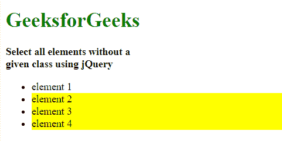
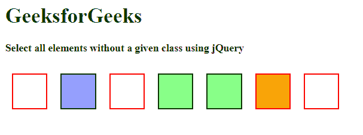

# 如何使用 jQuery 选择没有给定类的所有元素？

> 原文:[https://www . geeksforgeeks . org/如何使用-jquery/](https://www.geeksforgeeks.org/how-to-select-all-elements-without-a-given-class-using-jquery/) 选择不带给定类的所有元素

所有与给定选择器不匹配的元素都可以使用 jQuery 来选择(":not(selector)")。例如，第一个示例选择所有不活动的

*   Elements.

**示例 1:** 本示例选择不包含类**活动**的< li >元素。

```html
<!DOCTYPE html>
<html>

<head>
    <title>
        How to select all elements without
        a given class using jQuery ?
    </title>

    <meta charset="utf-8">

    <script src=
        "https://code.jquery.com/jquery-1.10.2.js">
    </script>
</head>

<body>
    <h1 style="color:green">GeeksforGeeks</h1>

    <b>
        Select all elements without a<br>
        given class using jQuery
    </b>

    <ul>
        <li class="active">element 1</li>
        <li>element 2</li>
        <li>element 3</li>
        <li>element 4</li>
    </ul>

    <script>
        $("li:not(.active)").css(
                "background-color", "yellow" );
    </script>
</body>

</html>
```

**输出:**


也可以使用。不是(选择器)。

**示例 2:** 本示例选择不包含类别**绿色**或 id **蓝色**的< div >元素。

```html
<!DOCTYPE html>
<html>

<head>
    <meta charset="utf-8">

    <script src=
        "https://code.jquery.com/jquery-1.10.2.js">
    </script>

    <style>
        div {
            width: 50px;
            height: 50px;
            margin: 10px;
            float: left;
            border: 2px solid black;
        }
        .green {
            background: #8f8;
        }
        .orange {
            background: orange;
        }
        #blue {
            background: #99f;
        }
    </style>
</head>

<body>
    <h1 style="color:green">GeeksforGeeks</h1>

    <b>
        Select all elements without a
        given class using jQuery
    </b>
    <br><br>

    <div></div>
    <div id="blue"></div>
    <div></div>
    <div class="green"></div>
    <div class="green"></div>
    <div class="orange"></div>
    <div></div>

    <script>
        $("div").not(".green, #blue")
            .css("border-color", "red");
    </script>
</body>

</html>
```

**输出:**
