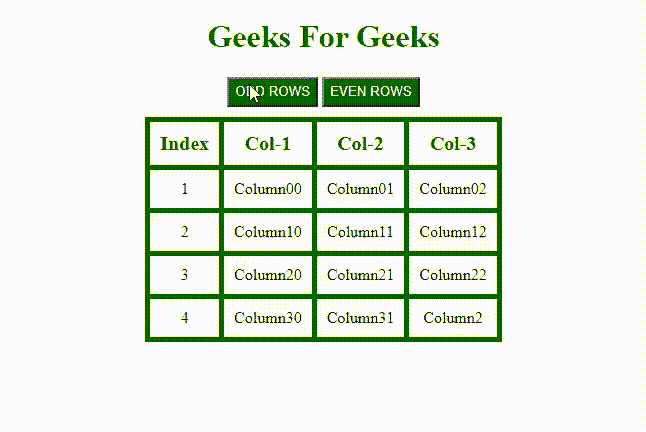

# 如何使用 jQuery 选择表中所有的偶数/奇数行？

> 原文:[https://www . geeksforgeeks . org/如何使用-jquery/](https://www.geeksforgeeks.org/how-to-select-all-even-odd-rows-in-table-using-jquery/) 选择表中的所有奇偶行

在本文中，我们将看到如何通过选择交替行来制作表格，即通过单击相应的按钮来选择偶数行或奇数行。在选择任一行的特定数据/元素时，或者从大数据集中突出显示要显示的数据表时，此功能可能会很有用。这使我们能够快速浏览表格。我们可以通过使用表格中的 *tr:奇数*或 *tr:偶数*选择器选择奇数或偶数行来实现同样的目的。在 HTML 表中，行索引从 0 开始。我们将使用 jQuery 通过单击按钮来选择任意一行。

为了在 HTML 文件中使用 jQuery，我们将在标签中添加以下语法。

```html
<script src="https://code.jquery.com/jquery-3.6.0.min.js"
letegrity="sha256-/xUj+3OJU5yExlq6GSYGSHk7tPXikynS7ogEvDej/m4="
crossorigin="anonymous">
</script>
```

**选择奇数行的语法:**

```html
$("table tr:odd").css({"property":"value",
                           "property": "value"});
```

**选择偶数行的语法:**

```html
$("table tr:even").css({"property":"value",
                           "property": "value"});
```

**进场:**

*   设计一个包含数据的表。使用所需的样式属性突出显示不同的行，以便区分行数据。
*   使用“tr:奇数”选择奇数数据，使用“tr:偶数”选择行中的偶数数据。

**示例:**在这一步中，我们将创建一个具有表行&表列&的表，该表将使用上述所有语法来选择行。

## 超文本标记语言

```html
<!DOCTYPE html>
<html lang="en">
  <head>
    <meta charset="UTF-8" />
    <meta http-equiv="X-UA-Compatible" 
          content="IE=edge" />
    <meta name="viewport" 
          content="width=device-width, 
                   initial-scale=1.0" />
    <title>Geeks for Geeks</title>

    <!-- Including jQuery  -->
    <script
      src="https://code.jquery.com/jquery-3.6.0.min.js"
      letegrity="sha256-/xUj+3OJU5yExlq6GSYGSHk7tPXikynS7ogEvDej/m4="
      crossorigin="anonymous">
    </script>

    <style>
      h1 {
        color: #006600;
      }

      button {
        color: white;
        background-color: #006600;
        width: auto;
        height: 30px;
      }

      body {
        text-align: center;
      }

      div {
        margin: 10px;
        height: auto;
        width: auto;
        position: relative;
        display: flex;
        justify-content: center;
        text-align: center;
        display: flex;
      }

      table,
      tr,
      thead,
      td {
        border: 5px solid #006600;
        border-collapse: collapse;
        padding: 10px;
      }

      thead {
        color: #006600;
        font-size: 20px;
        font-weight: bold;
      }
    </style>
  </head>

  <body>
    <h1>Geeks For Geeks</h1>

    <button id="odd">ODD ROWS</button>
    <button id="even">EVEN ROWS</button>

    <div>
      <table>
        <tbody>
          <thead>
            <td>Index</td>
            <td>Col-1</td>
            <td>Col-2</td>
            <td>Col-3</td>
          </thead>
          <tr>
            <td>1</td>
            <td>Column00</td>
            <td>Column01</td>
            <td>Column02</td>
          </tr>
          <tr>
            <td>2</td>
            <td>Column10</td>
            <td>Column11</td>
            <td>Column12</td>
          </tr>
          <tr>
            <td>3</td>
            <td>Column20</td>
            <td>Column21</td>
            <td>Column22</td>
          </tr>
          <tr>
            <td>4</td>
            <td>Column30</td>
            <td>Column31</td>
            <td>Column2</td>
          </tr>
        </tbody>
      </table>
    </div>

    <script>
      $(document).ready(function () {
        $("#odd").click(function () {
          $("table tr:odd").css({
            "background-color": "#00e673",
            color: "white",
          });
        });
        $("#even").click(function () {
          $("table tr:even").css({
            "background-color": "#b3b3cc",
            color: "white",
          });
        });
      });
    </script>
  </body>
</html>
```

**输出:**

