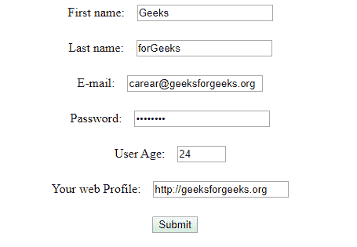

# 如何使用 JQuery 在输入中选择所有焦点？

> 原文:[https://www . geeksforgeeks . org/如何使用-jquery/](https://www.geeksforgeeks.org/how-to-select-all-on-focus-in-input-using-jquery/) 选择所有输入焦点

当用户在元素内部或在元素焦点上进行文本选择时，使用 jQuery 将 **select()事件**应用于元素。此事件仅限于某些领域。
**语法:**

```html
$("selected element").select();

```

```html
//Select all Input field on focus
$("input").select();
//Select Input field on focus whose type="text"
$("input[type='text']").select();
//Select input field using its id="input-field"
$("#input-field").select();

```

**示例:**
在下面的示例中，使用 focus、focus 和 click event 选择表单的所有输入元素。

```html
<!DOCTYPE html>
<html>

<head>
    <script src="
https://ajax.googleapis.com/ajax/libs/jquery/3.4.1/jquery.min.js
">
    </script>
    <style>
        input {
            margin: 12px;
        }

        ::-moz-selection {
            /* Code for Firefox */
            color: white;
            background: red;
        }

        ::selection {
            color: white;
            background: red;
        }
    </style>
</head>

<body align="center">
    <form action="/action_page.php" 
          autocomplete="off">
        First name:
        <input type="text" 
               name="fname" 
               value="Geeks"
               required>
        <br> Last name:
        <input type="text"
               name="lname"
               value="forGeeks"
               required>
        <br> E-mail:
        <input type="email" 
               name="eid" 
               value="carear@geeksforgeeks.org" />
        <br> Password:
        <input type="password" 
               name="upwd" 
               value="********"
               required maxlength="8">
        <br> User Age:
        <input type="number" 
               name="Test"
               min="10" 
               value="24" 
               max="80" 
               required/>
        <br> Your web Profile:
        <input type="url" 
               name="Test" 
               value="http://geeksforgeeks.org"
               required />
        <br>
        <input type="submit" value="Submit">
    </form>
    <script>
        $("input[type='text']").on("click", function() {
            $(this).select();
        });
        $("input").focus(function() {
            $(this).select();
        });
        $("input").focusin(function() {
            $(this).select();
        });
    </script>
</body>

</html>
```

**输出:**
