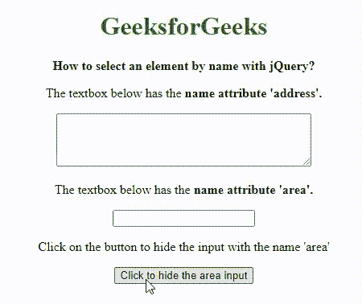
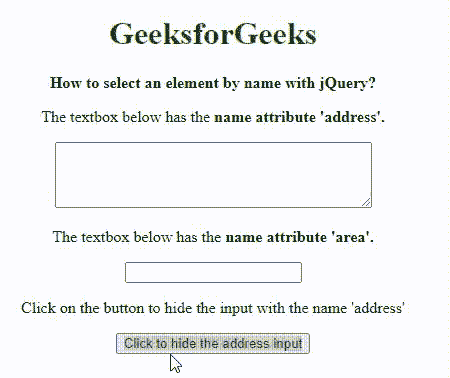

# 如何用 jQuery 按名称选择元素？

> 原文:[https://www . geesforgeks . org/如何用 jquery 按名称选择元素/](https://www.geeksforgeeks.org/how-to-select-an-element-by-name-with-jquery/)

在本文中，我们将学习在 jQuery 中按名称获取选定的元素。可以使用两种方法通过名称属性选择元素:

*   通过使用名称选择器方法
*   通过使用 JavaScript 按名称获取元素并将其传递给 jQuery

我们将通过例子来理解这两种方法。

**方法 1:使用名称选择器方法**

名称属性选择器可用于按名称选择元素。该选择器选择值完全等于指定值的元素。

**语法:**

```
[name="nameOfElement"]
```

**示例:**该示例说明了使用**名称选择器**方法选择特定元素。

## 超文本标记语言

```
<!DOCTYPE html>
<html>

<head>
    <title>
          How to select an element by name with jQuery?
      </title>
</head>

<body>
    <center>
        <h1 style="color: green">GeeksforGeeks</h1>
        <b>How to select an element by name with jQuery?</b>
        <p>
            The textbox below has the <b>name attribute 'address'.</b>
          <form>
              <textarea rows="4" cols="40" name="address"></textarea>
          </form>
        </p>

        <p>
            The textbox below has the 
              <b>name attribute 'area'.</b>
        <form>
            <input type="text" name="area">
        </form>
        </p>

        <p>Click on the button to hide the input with
            the name 'area'</p>

        <button onclick="selectByName()">
            Click to hide the area input
        </button>
        <script src=
"https://code.jquery.com/jquery-3.3.1.min.js">
        </script>
        <script type="text/javascript">
            function selectByName() {
                element = $('[name="area"]');

                //hide the element
                element.hide();
            }
        </script>
    </center>
</body>

</html>
```

**输出:**



名称选择器方法

**方法二:用 JavaScript 按名称获取元素，传递给 jQuery**

可以使用 JavaScript[**getElementsByName()方法**](https://www.geeksforgeeks.org/html-dom-getelementsbyname-method/) 来选择所需的元素，并将其传递给 jQuery 函数，以进一步将其用作 jQuery 对象。

**语法:**

```
selector = document.getElementsByName('nameOfElement');
element = $(selector);
```

**示例:**此示例说明了使用 **getElementsByName()方法**按名称获取特定文档的所有元素的集合

## 超文本标记语言

```
<!DOCTYPE html>
<html>

<head>
    <title>
      How to select an element by name with jQuery?
      </title>
</head>

<body>
    <center>
        <h1 style="color: green">GeeksforGeeks</h1>
        <b>How to select an element by name with jQuery?</b>
        <p>
            The textbox below has the 
              <b>name attribute 'address'.</b>
        <form>
            <textarea rows="4" cols="40" name="address"></textarea>
        </form>
        </p>

        <p>
            The textbox below has the 
              <b>name attribute 'area'.</b>
        <form>
            <input type="text" name="area">
        </form>
        </p>

        <p>
          Click on the button to hide the
          input with the name 'address'
         </p>

        <button onclick="selectByName()">
            Click to hide the address input
        </button>
        <script src=
"https://code.jquery.com/jquery-3.3.1.min.js">
        </script>
        <script type="text/javascript">
            function selectByName() {
                selector = document.getElementsByName('address');
                element = $(selector);

                // hide the element
                element.hide();
            }
        </script>
    </center>
</body>

</html>
```

**输出:**



通过元素的名称获取元素

jQuery 是一个开源的 JavaScript 库，它简化了一个 HTML/CSS 文档之间的交互，它以**“少写多做”**的理念而闻名。详情请参考 [jQuery 教程](https://www.geeksforgeeks.org/jquery-tutorials/)和 [jQuery 示例](https://www.geeksforgeeks.org/jquery-examples/)文章。