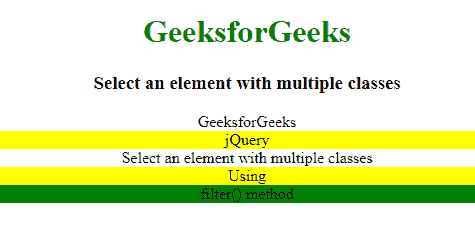
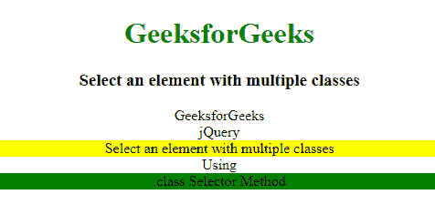

# 如何使用 jQuery 选择一个有多个类的元素？

> 原文:[https://www . geeksforgeeks . org/如何使用-jquery/](https://www.geeksforgeeks.org/how-to-select-an-element-with-multiple-classes-using-jquery/) 选择具有多个类的元素

使用 jQuery 选择具有多个类的元素有两个过程。下面用适当的例子描述这两个过程。

**[使用 filter()方法:](https://www.geeksforgeeks.org/jquery-filter/)** 使用 filter()方法，我们可以过滤掉所有与所选条件不匹配的元素，这些匹配将被返回。

*   **语法:**

    ```html
    $(selector).filter(criteria, function(index))
    ```

*   **例:**

    ```html
    <!DOCTYPE html> 
    <html> 

    <head> 
        <title> 
            jQuery | Select an element
            with multiple classes
        </title> 

        <style> 
            h1 { 
                color: green; 
            } 
            body { 
                text-align: center; 
            } 
        </style> 

        <script src=
    "https://code.jquery.com/jquery-1.12.4.min.js">
        </script>
    </head> 

    <body> 
        <h1>GeeksforGeeks</h1>

        <h3>
            Select an element with
            multiple classes
        </h3> 

        <div class="geeks">GeeksforGeeks</div>
        <div class="geeks geeks1">jQuery</div>

        <div class="geeks1">
            Select an element with
            multiple classes
        </div>

        <div class="geeks1 geeks">Using</div>
        <div class="geeks geeks1 geeks2">
            filter() method
        </div>

        <script>
            $(document).ready(function(){
                $(".geeks").filter(".geeks1").css(
                    "background-color", "yellow");

                $(".geeks.geeks2").filter(".geeks1")
                    .css("background-color", "green");
            });
        </script>
    </body> 

    </html>
    ```

*   **输出:** 

**[使用。类选择器:](https://www.geeksforgeeks.org/jquery-class-selector/)** 通过使用。类选择器指定要选择的元素的类。它不应该以数字开头。它为几个 HTML 元素赋予了样式。

*   **语法:**

    ```html
    $(".class1.class2.class3...")
    ```

*   **例:**

    ```html
    <!DOCTYPE html> 
    <html> 

    <head> 
        <title> 
            jQuery | Select an element
            with multiple classes
        </title> 

        <style> 
            h1 { 
                color: green; 
            } 
            body { 
                text-align: center; 
            } 
        </style> 

        <script src=
    "https://code.jquery.com/jquery-1.12.4.min.js">
        </script>
    </head> 

    <body> 
        <h1>GeeksforGeeks</h1> 

        <h3> 
            Select an element with
            multiple classes
        </h3> 

        <div class="geeks">GeeksforGeeks</div>
        <div class="geeks geeks1">jQuery</div>

        <div class="geeks1">
            Select an element with
            multiple classes
        </div>

        <div class="geeks1 geeks">Using</div>
        <div class="geeks geeks1 geeks2">
            .class Selector Method
        </div>

        <script>
            $(document).ready(function(){
                $(".geeks1").css(
                    "background-color", "yellow");

                $(".geeks").css(
                    "background-color", "white");

                $(".geeks.geeks2").css(
                    "background-color", "green");
            });
        </script>
    </body> 

    </html>
    ```

*   **输出:** 