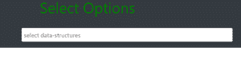
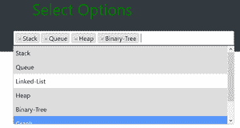
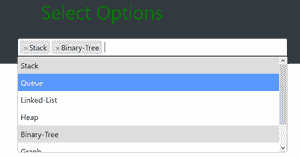

# 如何使用 jQuery 在下拉列表中选择/取消选择多个选项？

> 原文:[https://www . geesforgeks . org/如何选择-取消选择-下拉列表中的多个选项-使用-jquery/](https://www.geeksforgeeks.org/how-to-select-deselect-multiple-options-in-dropdown-using-jquery/)

要在下拉菜单中选择和取消选择多个选项，我们将使用 HTML 和 CSS 代码。HTML 代码有助于定义网页的基本结构，CSS 将有助于设计网页。

代码中使用的一些基本属性如下-

*   **<div>**–这是一个 division 标签，帮助我们定义要引用的 HTML 代码的特定部分，稍后可以在 CSS 样式表中轻松编辑。
*   **<链接 rel= "样式表" href = " T3 "**–该标签包含我们创建的 CSS 样式表的链接，并继承了我们想要在网页中进行的样式表的所有修改。
*   **容器-流体**–这个类提供了一个贯穿整个网站的全宽容器。
*   **<div class = " row ">**-这是一个引导网格系统，帮助我们在一个页面上填充多达 12 行。
*   **多重选择**–该类允许我们从下拉菜单中的各种选项中进行选择。

**方法:**这是一个简单的 HTML 代码，用于在网站中显示下拉菜单，我们可以在其中选择多个数据结构选项，并使用多选选项取消选择其他选项。

**例:**

## 超文本标记语言

```html
<!DOCTYPE html>
<html lang="en">

<head>
    <meta charset="UTF-8">
    <meta name="viewport" content=
        "width=device-width, initial-scale=1.0">

    <!-- These are the jQuery extensions taken from
        bootstrap website to enable the drop down
        function of the menu bar -->
    <link rel="stylesheet" href=
"https://cdnjs.cloudflare.com/ajax/libs/select2/4.0.0/css/select2.min.css">

    <script src=
"https://cdnjs.cloudflare.com/ajax/libs/jquery/2.1.3/jquery.min.js">
    </script>

    <script src=
"https://cdnjs.cloudflare.com/ajax/libs/select2/4.0.0/js/select2.min.js">
    </script>

    <!-- Default bootstrap CSS link taken from the
        bootstrap website-->
    <link rel="stylesheet" href=
"https://maxcdn.bootstrapcdn.com/bootstrap/4.4.1/css/bootstrap.min.css">

    <script src=
"https://maxcdn.bootstrapcdn.com/bootstrap/4.4.1/js/bootstrap.min.js">
    </script>

    <style>
        .mul-select {
            width: 160%;
        }

        h1 {
            color: green;
        }
    </style>
</head>

<body>
    <div class="container-fluid h-300 bg-dark">
        <div class="row justify-content-center align-items-center">
            <h1>Select Options</h1>
        </div>
        <br>

        <!-- These modifications are done to make the webpage
            adaptive to the screen size and automatically
            reduce the size when screen is minimized -->
        <div class="row justify-content-center align-items-center h-100">
            <div class="col col-sm-6 col-md-6 col-lg-4 col-xl-3">
                <div class="form-group">

                    <!-- Various options in drop down menu to
                        select the types of data structures
                        that we need -->
                    <select class="mul-select" multiple="true">
                          <option value="Stack">Stack</option>
                          <option value="Queue">Queue</option>
                          <option value="Linked-List">Linked-List</option>
                          <option value="Heap">Heap</option>
                          <option value="Binary-Tree">Binary-Tree</option>
                          <option value="Graph">Graph</option>
                          <option value="Array">Array</option>
                      </select>
                </div>
            </div>
        </div>
    </div>

    <!-- JavaScript code to enable the drop down function -->
    <script>
        $(document).ready(function() {
            $(".mul-select").select2({
                placeholder: "select data-structures",
                tags: true,
            });
        })
    </script>
</body>

</html>
```

在 HTML 代码中，我们还包含了一些 JavaScript 代码，因为在网页中，任何要执行的功能都必须使用 JavaScript。



正如我们在浏览器中打开文件时看到的，这是获得的输出，我们得到了所需的下拉框



这表明我们能够通过点击一次选择多个选项。除此之外，我们还可以观察到，所有选择的选项都用灰色阴影表示。

要取消选择所选选项，我们只需点击文本附近的十字按钮，该选项将自动取消选择，下拉菜单中的灰色阴影也已被移除



下载引导、css 和 JavaScript 扩展的来源-[https://getbootstrap . com/docs/4.5/入门/简介/](https://getbootstrap.com/docs/4.5/getting-started/introduction/)