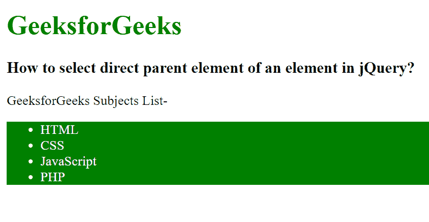

# 如何在 jQuery 中选择一个元素的直接父元素？

> 原文:[https://www . geeksforgeeks . org/如何选择-直接-父元素-jquery 中的元素/](https://www.geeksforgeeks.org/how-to-select-direct-parent-element-of-an-element-in-jquery/)

在本文中，我们将使用 jQuery 选择元素的直接父元素。要选择直接父元素，请使用 parent()方法。此方法查找与选定元素相关的父元素。这个 parent()方法遍历所选元素的单个级别并返回该元素。

**语法:**

```html
$(selector).parent()
```

**示例:**

## 超文本标记语言

```html
<!DOCTYpe html>
<html>

<head>
    <title>
        How to select direct parent element
        of an element in jQuery?
    </title>

    <script src=
"https://ajax.googleapis.com/ajax/libs/jquery/3.3.1/jquery.min.js">
    </script>

    <script>
        $(document).ready(function () {
            $("li").parent().css({
                color: "white",
                background: "green"
            });
        });
    </script>
</head>

<body>
    <h1 style="color: green;">
        GeeksforGeeks
    </h1>

    <h3>
        How to select direct parent element
        of an element in jQuery?
    </h3>

    <p>GeeksforGeeks Subjects List-</p>

    <ul>
        <li>HTML</li>
        <li>CSS</li>
        <li>JavaScript</li>
        <li>PHP</li>
    </ul>
</body>

</html>
```

**输出:**

