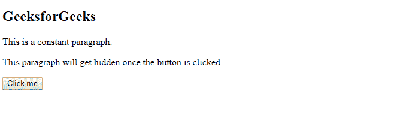
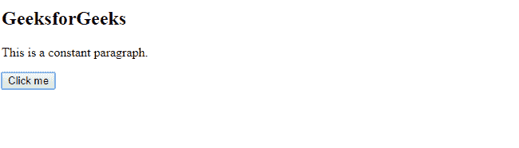
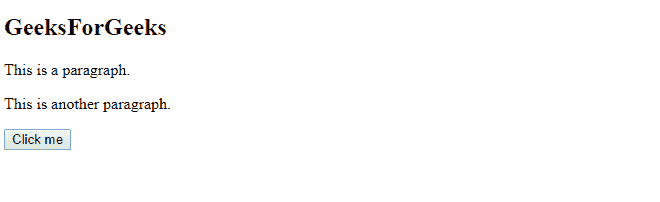
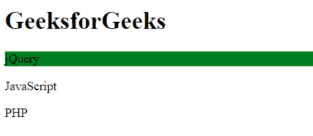

# jQuery 中如何按属性选择元素？

> 原文:[https://www . geesforgeks . org/如何在 jquery 中按属性选择元素/](https://www.geeksforgeeks.org/how-to-select-elements-by-attribute-in-jquery/)

jQuery 是一个轻量级的 JavaScript 库。在普通的 JavaScript 语言中，getElementById 方法用于选择一个元素。然而，出于同样的目的，jQuery 提供了一个轻得多的替代方案。“jQuery 选择器”允许用户操作 HTML 元素和其中的数据(DOM 操作)。

**语法**

```html
$("[attribute=value]")
```

这里，属性和值是必需的。

**一些最常用的 jQuery 选择器**

| 句法 | 例子 | 选择 |
| --- | --- | --- |
| * | $("*") | 网页上的所有元素 |
| #id | $(“#极客”) | id 为“极客”的元素 | 。班级 | $(".极客”) | class=“极客”的所有元素 | :首先 | $(“p:第一名”) | 网页的第一个“p”元素 | :标题 | $(":标题") | 所有标题元素，如 h1、h2、h3、h4 等 | :空 | $(“:空”) | 所有的空元素 | :输入 | $(“:输入”) | 所有输入元素，如文本、密码等 | :文本 | $(":文本") | type="text "的输入元素 | :最后一个孩子 | $(“p:最后一个孩子”) | 那些“p”元素是它们父母的最后一个孩子 | :动画 | $(“:动画”) | 网页上的所有动画元素 |

**[#id 选择器](https://www.geeksforgeeks.org/jquery-id-selector/):**id 选择器为要选择的元素指定一个 id。它不应该以数字开头，并且 id 属性在文档中必须是唯一的，这意味着它只能使用一次。

**语法:**

```html
$("#example")
```

id 选择器必须仅在用户想要查找唯一元素时使用。

**示例:**

```html
<!DOCTYPE html>
<html>

<head>
    <title>
        How to select elements from
        attribute in jQuery ?
    </title>

    <script src=
"https://ajax.googleapis.com/ajax/libs/jquery/3.4.1/jquery.min.js">
    </script>

    <script>
        $(document).ready(function() {
            $("button").click(function() {
                $("#para").hide();
            });
        });
    </script>
</head>

<body>
    <h2>GeeksforGeeks</h2>

    <p>This is a constant paragraph.</p>

    <p id="para">
        This paragraph will get hidden once
        the button is clicked.
    </p>

    <button>Click me</button>
</body>

</html>
```

**输出:**

*   **之前点击按钮:**
    
*   **点击按钮后:**
    

**[。等级选择器](https://www.geeksforgeeks.org/jquery-class-selector/):T3。类选择器指定要选择的元素的类。它不应该以数字开头。它为几个 HTML 元素赋予了样式。**

```html
$(".example")
```

**示例:**

```html
<!DOCTYPE html>
<html>

<head>
    <script src=
"https://ajax.googleapis.com/ajax/libs/jquery/3.4.1/jquery.min.js">
    </script>

    <script>
        $(document).ready(function() {
            $("button").click(function() {
                $(".test").hide();
            });
        });
    </script>
</head>

<body>
    <h2 class="heading">GeeksForGeeks</h2>

    <p class="test">This is a paragraph.</p>
    <p class="test">This is another paragraph.</p>

    <button>Click me</button>
</body>

</html>
```

**输出:**

*   **之前点击按钮:**
    
*   **点击按钮后:**
    

**[:第一选择器](https://www.geeksforgeeks.org/jquery-first-selector/) :** 是一个 jQuery 选择器，用于选择指定类型的第一个元素。

**语法:**

```html
$(":first")
```

**示例:**

```html
<!DOCTYPE html> 
<html> 

<head> 
    <title>jQuery :first selector</title>

    <script src= 
"https://ajax.googleapis.com/ajax/libs/jquery/3.3.1/jquery.min.js"> 
    </script> 

    <script> 
        $(document).ready(function() { 
            $("p:first").css( 
            "background-color", "green"); 
        }); 
    </script> 
</head> 

<body> 
    <h1>GeeksforGeeks</h1>
    <p>jQuery</p> 
    <p>JavaScript</p> 
    <p>PHP</p> 
</body> 

</html> 
```

**输出:**
