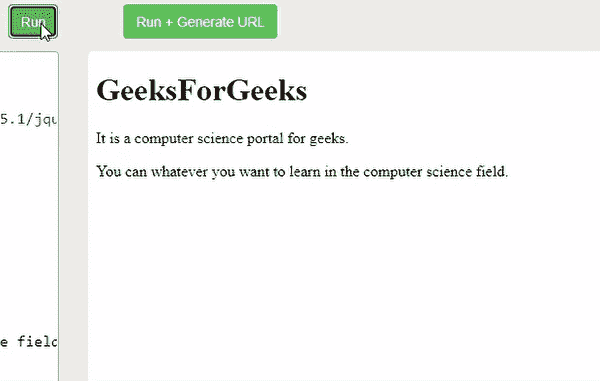
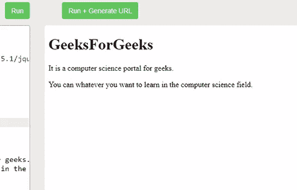

# 如何使用 jQuery 选择没有可见子元素的元素？

> 原文:[https://www . geeksforgeeks . org/如何使用-jquery/](https://www.geeksforgeeks.org/how-to-select-elements-with-no-visible-children-using-jquery/) 选择不可见子元素

在本文中，我们将学习如何选择属性不可见或不隐藏的元素。这仅仅意味着该特定元素的显示属性是隐藏的，我们需要使用 Jquery 显示该元素中存在的任何内容。

我们可以通过使用 Jquery:隐藏选择器轻松做到这一点。首先，让我们看看你将如何知道元素是隐藏的，这些元素被设置为显示:无；type="hidden "，Width 和 height 设置为 0 的表单元素或隐藏的父元素，该父元素也将隐藏其子元素。

*   [**jQuery:隐藏选择器:**](https://www.geeksforgeeks.org/jquery-hidden-selector/) 该选择器的任务是选择具有隐藏属性的元素。

**语法–**

```html
$(":hidden")
```

*   [**jQuery show()**](https://www.geeksforgeeks.org/jquery-ui-show-method/)Method[**:**](https://www.geeksforgeeks.org/jquery-ui-show-method/)用于显示选择器选择的隐藏元素。

**语法:**

```html
$(selector).show(speed,easing,callback) 
// All parameters are optional.
```

**例 1 :**

## 超文本标记语言

```html
<!DOCTYPE html>
<html>
  <head>
    <script src=
"https://ajax.googleapis.com/ajax/libs/jquery/3.5.1/jquery.min.js">
    </script>
    <script>
      $(document).ready(function () {
        $("h1:hidden").show(5500);
      });
    </script>
  </head>
  <body>
    <h1 style="display: none">GeeksForGeeks</h1>

<p>It is a computer science portal for geeks.</p>

<p>
      You can whatever you want to learn in
      the computer science field.
    </p>

  </body>
</html>
```

**输出:**



**示例 2:** 我们有一个带有显示的标题标签:无属性，其余标签可见。当您首先运行代码时，它会在隐藏选择器和的帮助下向您显示可见的内容，然后显示隐藏的标签。show()方法。

## 超文本标记语言

```html
<!DOCTYPE html>
<html>
  <head>
    <script src=
"https://ajax.googleapis.com/ajax/libs/jquery/3.5.1/jquery.min.js">
    </script>
    <script>
      $(document).ready(function () {
        $("p:hidden").show(5500);
      });
    </script>
  </head>
  <body>
    <h1>GeeksForGeeks</h1>
    <p style="display: none">
      It is a computer science portal for geeks.
    </p>

    <p style="display: none">
      You can whatever you want to learn in
      the computer science field.
    </p>

  </body>
</html>
```

**输出:**

