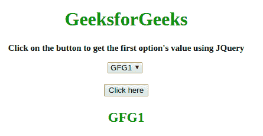

# 如何使用 jQuery 选择下拉列表中的第一个元素？

> 原文:[https://www . geesforgeks . org/如何使用-jquery/](https://www.geeksforgeeks.org/how-to-select-first-element-in-the-drop-down-list-using-jquery/) 选择下拉列表中的第一个元素

给定一个包含选项元素的下拉列表，任务是使用 JQuery 获取**选择**元素的第一个元素。
**进场 1:**

*   选择 **<的第一个元素，使用 JQuery 选择器选择>元素**。
*   使用 [**。道具()属性**](https://www.geeksforgeeks.org/jquery-prop-with-examples/) 获取该特定元素的属性。
*   将 **selectedIndex** 属性更改为 0，以获取对第一个元素的访问。(索引以 0 开头)

**示例:**这个示例说明了上面讨论的方法。

## 超文本标记语言

```
<!DOCTYPE HTML> 
<html> 

<head> 
    <title> 
        How to select first element in the
        drop-down list using jQuery ? 
    </title>

    <script src=
"https://ajax.googleapis.com/ajax/libs/jquery/3.4.1/jquery.min.js">
    </script>
</head> 

<body style = "text-align:center;"> 

    <h1 style = "color:green;" > 
        GeeksforGeeks 
    </h1>

    <p id = "GFG_UP" style =
            "font-size: 15px; font-weight: bold;">
    </p>

    <select id = "select"> 
        <option value="GFG1">GFG1</option>
        <option value="GFG2">GFG2</option>
        <option value="GFG3">GFG3</option>
        <option value="GFG4">GFG4</option>
        <option value="GFG5">GFG5</option>
    </select> 

    <br><br>

    <button onclick = "gfg_Run()"> 
        Click here
    </button>

    <p id = "GFG_DOWN" style =
        "font-size: 23px; font-weight: bold; color: green; ">
    </p>

    <script>
        var el_up = document.getElementById("GFG_UP");
        var el_down = document.getElementById("GFG_DOWN");

        el_up.innerHTML = "Click on the button to get the "
                    + "first option's value using JQuery"; 

        function gfg_Run() {
            el_down.innerHTML = 
                $("#select").prop("selectedIndex", 0).val();
        }         
    </script> 
</body> 

</html>
```

**输出:**

*   **点击按钮前:**


*   **点击按钮后:**


**进场 2:**

*   选择 **<使用 JQuery 选择器选择>元素**。
*   该选择器更具体，使用**选项选择第一个元素:第 n 个子元素(1)** 。
*   这将获得对以 1 开头的第一个 lemon _index 的访问权)。

**示例:**这个示例说明了上面讨论的方法。

## 超文本标记语言

```
<!DOCTYPE HTML> 
<html> 

<head> 
    <title> 
        How to select first element in the
        drop-down list using jQuery ? 
    </title>

    <script src=
"https://ajax.googleapis.com/ajax/libs/jquery/3.4.1/jquery.min.js">
    </script>
</head> 

<body style = "text-align:center;"> 

    <h1 style = "color:green;" > 
        GeeksforGeeks 
    </h1>

    <p id = "GFG_UP" style = 
        "font-size: 15px; font-weight: bold;">
    </p>

    <select id = "select"> 
        <option value="GFG1">GFG1</option>
        <option value="GFG2">GFG2</option>
        <option value="GFG3">GFG3</option>
        <option value="GFG4">GFG4</option>
        <option value="GFG5">GFG5</option>
    </select> 

    <br><br>

    <button onclick = "gfg_Run()"> 
        Click here
    </button>

    <p id = "GFG_DOWN" style = 
        "font-size: 23px; font-weight: bold; color: green; ">
    </p>

    <script>
        var el_up = document.getElementById("GFG_UP");
        var el_down = document.getElementById("GFG_DOWN");

        el_up.innerHTML = "Click on the button to get the"
                + " first option's value using JQuery"; 

        function gfg_Run() {
            el_down.innerHTML = 
                $('#select option:nth-child(1)').val();
        }         
    </script> 
</body> 

</html>
```

**输出:**

*   **点击按钮前:**


*   **点击按钮后:**



jQuery 是一个开源的 JavaScript 库，它简化了 HTML/CSS 文档之间的交互，它以其“少写多做”的理念而闻名。
跟随本 [jQuery 教程](https://www.geeksforgeeks.org/jquery-tutorials/)和 [jQuery 示例](https://www.geeksforgeeks.org/jquery-examples/)可以从头开始学习 jQuery。