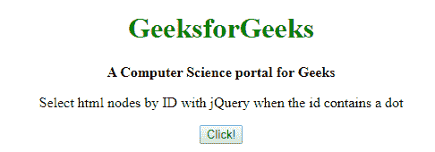
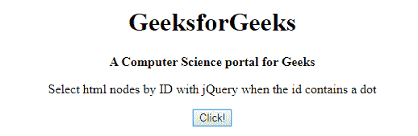
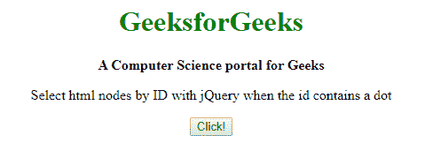
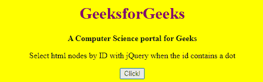

# 当 ID 包含点字符时，如何在 jQuery 中使用 ID 选择 html 元素？

> 原文:[https://www . geesforgeks . org/how-select-html-element-using-id-in-jquery-when-id-contains-a-dot-character/](https://www.geeksforgeeks.org/how-to-select-html-element-using-id-in-jquery-when-id-contains-a-dot-character/)

任务是当标识本身包含一个**点** (' **)时，使用 jQuery 按标识选择一个 HTML 元素/节点。**’)。不仅仅是点(。)还有很多其他的元字符比如`! " # $ % & ' ( ) * + , . / : ; < = > ? @ [ \ ] ^ ` { | } ~`可以通过这个程序选择。

**语法:**

```html
$('#ID_PREFIX\\.ID_SUFFIX')
```

**方法:**为了通过 ID 选择一个 HTML 元素，我们只需要使用双斜线( **\\** )对其进行转义。

**示例 1:** 在本例中，我们将使用 jQuery 更改标题元素的颜色。

```html
<!DOCTYPE html>
<html>

<head>
    <title>
        How to select html element using ID in
        jQuery when ID contains a dot character ?
    </title>

    <script src=
        "https://code.jquery.com/jquery-3.4.1.min.js">
    </script>
</head>

<body style="text-align:center;">

    <!-- Heading with ID containing a DOT that
        will be selected later -->
    <h1 id="Geeks.Head" style="color: green;">
        GeeksforGeeks
    </h1>

    <b>
        A Computer Science
        portal for Geeks
    </b>
    <br>

    <p>
        Select html nodes by ID with jQuery
        when the id contains a dot
    </p>

    <button style="color: green;">
        Click!
    </button>

    <script type="text/javascript">
        $('button').click(function() {

            // Selecting ID containing a
            // DOT by escaping using '\\'
            $('#Geeks\\.Head').css({
                'color': 'black'
            });
        });
    </script>
</body>

</html>
```

**输出:**

*   **点击按钮前:**
    
*   **点击按钮后:**
    

**示例 2:** 在本例中，我们将选择一个 ID 包含多个点的元素，并更改其背景颜色(也带有标题)。

```html
<!DOCTYPE html>
<html>

<head>
    <title>
        How to select html element using ID in
        jQuery when ID contains a dot character ?
    </title>

    <script src=
"https://code.jquery.com/jquery-3.4.1.min.js">
    </script>
</head>

<!-- id contains dot(.) -->
<body id="Main..Body">
    <center>

        <!-- id contains dot(.) -->
        <h1 id="Geeks.Head" style="color: green;">
            GeeksforGeeks
        </h1>

        <b>
            A Computer Science
            portal for Geeks
        </b>
        <br>

        <p>
            Select html nodes by ID with jQuery
            when the id contains a dot
        </p>

        <button style="color: green;">
            Click!
        </button>
    </center>

    <script type="text/javascript">
        $('button').click(function() {

            // Selecting ID containing a
            // DOT by escaping using '\\'
            $('#Geeks\\.Head').css({
                'color': 'purple'
            });

            // Selecting ID containing
            // multiple DOTs
            $('#Main\\.\\.Body').css({
                'background-color': 'Yellow'
            });
        });
    </script>
</body>

</html>
```

**输出 2:**

*   **点击按钮前:**
    
*   **点击按钮后:**
    