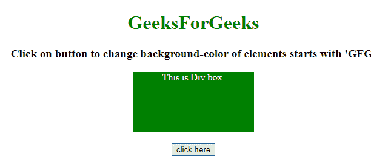
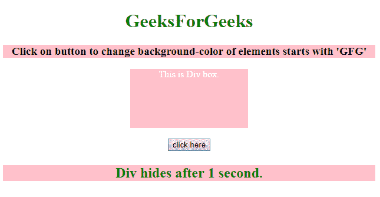

# 如何使用 jQuery 选择以某个字符开头的 ID？

> 原文:[https://www . geeksforgeeks . org/如何选择以特定字符开头的 id-use-jquery/](https://www.geeksforgeeks.org/how-to-select-id-that-starts-with-certain-character-using-jquery/)

给定一个 HTML 文档，任务是使用 jQuery 选择以特定字符开头的元素。

**方法:**使用 jquery[【attribute^=value】选择器](https://www.geeksforgeeks.org/jquery-attributevalue-selector-6/)选择 ID 以特定字符开头的元素。

**示例 1:** 本示例选择 ID 以“GFG”开头的元素，并更改其背景颜色。

```
<!DOCTYPE HTML> 
<html> 
    <head> 
        <title> 
            How to select ID starts with
            certain character in jQuery ?
        </title>

        <style>
            #GFG_DIV {
                background: green;
                height: 100px;
                width: 200px;
                margin: 0 auto;
                color: white;
            }
        </style>

        <script src = 
"https://ajax.googleapis.com/ajax/libs/jquery/3.4.0/jquery.min.js">
        </script>
    </head> 

    <body style = "text-align:center;"> 

        <h1 style = "color:green;" > 
            GeeksForGeeks 
        </h1>

        <p id = "GFG_UP" style = 
            "font-size: 19px; font-weight: bold;">
        </p>

        <div id = "GFG_DIV">
            This is Div box.
        </div>

        <br>

        <button onClick = "GFG_Fun()">
            click here
        </button>

        <p id = "GFG_DOWN" style =
            "color: green; font-size: 24px; font-weight: bold;">
        </p>

        <script>
            $('#GFG_UP').text("Click on button to change "
                        + "background-color of element's "
                        + "ID starts with 'GFG'");
            function GFG_Fun() {
                $( "[id^='GFG']" ).css("background-color", "pink");
                $('#GFG_DOWN').text("Div hides after 1 second."); 
            }
        </script> 
    </body> 
</html>                    
```

**输出:**

*   **点击按钮前:**
    
*   **点击按钮后:**
    

**示例 2:** 本示例选择 ID 以“GFG”开头的元素，并设置其背景颜色。

```
<!DOCTYPE HTML> 
<html> 
    <head> 
        <title> 
            How to select ID starts with
            certain character in jQuery ?
        </title>

        <style>
            #GFG_DIV {
                background: green;
                height: 100px;
                width: 200px;
                margin: 0 auto;
                color: white;
            }
        </style>

        <script src = 
"https://ajax.googleapis.com/ajax/libs/jquery/3.4.0/jquery.min.js">
        </script>
    </head> 

    <body style = "text-align:center;"> 

        <h1 style = "color:green;" > 
            GeeksForGeeks 
        </h1>

        <p id = "GFG_UP" style = 
            "font-size: 19px; font-weight: bold;">
        </p>

        <div id = "GFG_DIV">
            This is Div box.
        </div>

        <br>

        <button onClick = "GFG_Fun()">
            click here
        </button>

        <p id = "GFG_DOWN" style =
            "color: green; font-size: 24px; font-weight: bold;">
        </p>

        <script>
            $('#GFG_UP').text("Click on button to change "
                        + "background-color of element's "
                        + "ID starts with 'GFG'");
            function GFG_Fun() {
                var value = "GFG";
                $("[id^='" + value + "']" ).css("background-color", "pink");
                $('#GFG_DOWN').text("Div hides after 1 second."); 
            }
        </script> 
    </body> 
</html>                    
```

**输出:**

*   **点击按钮前:**
    
*   **点击按钮后:**
    