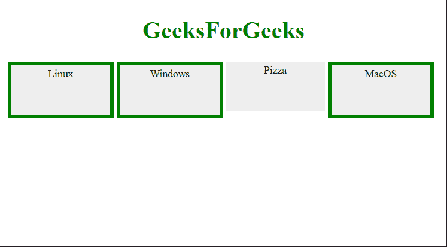

# 如何使用 jQuery 选择多个元素？

> 原文:[https://www . geeksforgeeks . org/如何使用-jquery/](https://www.geeksforgeeks.org/how-to-select-multiple-elements-using-jquery/) 选择多个元素

在本文中，我们将学习如何使用 JQuery 选择多元素。 **JQuery** 是速度最快且轻量级的 JavaScript 库，用于简化 HTML/CSS 文档(更准确地说是文档对象模型(DOM))和 JavaScript 之间的交互。JQuery 以其“少写多做”的座右铭而闻名它只是意味着你只需要写几行代码就可以实现你的目标。

**方法:**我们可以使用“{content}”选择任意多的类；选择课程。如果你愿意，你可以指定任意数量的选择器来组合成一个结果。这个**多表达式组合器**是选择不同元素的有效方法，返回的 jQuery 对象中 DOM 元素的顺序可能不相同，因为它们将按照文档顺序排列。

**语法:**

```html
$( "classOne, classTwo, classThree" )
      .css( "property name", "value" );
```

**示例:**

## 超文本标记语言

```html
<!doctype html>
<html lang="en">

<head>
    <style>
        div,
        span,
        p {
            width: 126px;
            height: 60px;
            float: left;
            padding: 3px;
            margin: 2px;
            background-color: #eee;
            font-size: 14px;
        }

        body {
            text-align: center;
        }
    </style>
    <script src=
"https://code.jquery.com/jquery-3.5.0.js">
    </script>
</head>

<body>
    <h1 style="color:green">GeeksForGeeks</h1>
    <div>Linux</div>
    <p class="myClass">Windows</p>

    <p class="notMyClass">Pizza</p>

    <span>MacOS</span>
    <script>
        $("div, span, p.myClass")
          .css("border", "5px solid green");
    </script>
</body>

</html>
```

**输出:**

