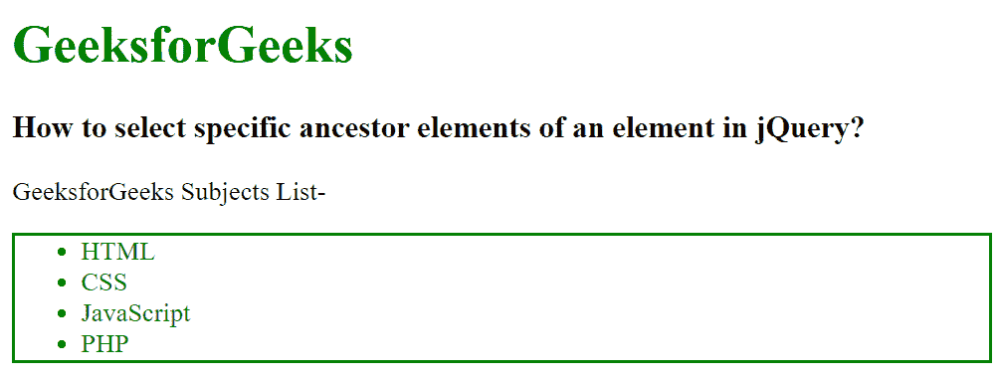

# 如何在 jQuery 中选择一个元素的具体祖先？

> 原文:[https://www . geeksforgeeks . org/如何选择特定于 jquery 中元素的祖先/](https://www.geeksforgeeks.org/how-to-select-specific-ancestors-of-an-element-in-jquery/)

在本文中，我们将选择 jQuery 中某个元素的特定祖先元素。为了选择元素的特定祖先元素，我们使用 parents()方法。此方法用于查找与所选元素相关的父元素。这个 parents()方法遍历所选元素的所有级别，并返回所有元素。

**语法:**

```
$(selector).parents()
```

这里选择器是所有父元素都需要查找的选定元素。它返回所选元素的所有父元素。

**示例:**

## 超文本标记语言

```
<!DOCTYpe html>
<html>

<head>
    <title>
        How to select specific ancestor 
        elements of an element in jQuery?
    </title>

    <script src=
"https://ajax.googleapis.com/ajax/libs/jquery/3.3.1/jquery.min.js">
    </script>

    <script>
        $(document).ready(function () {
            $("li").parents("ul").css({
                color: "green",
                border: "2px solid green"
            });
        });
    </script>
</head>

<body>
    <h1 style="color: green;">
        GeeksforGeeks
    </h1>

    <h3>
        How to select specific ancestor 
        elements of an element in jQuery?
    </h3>

    <p>GeeksforGeeks Subjects List-</p>

    <ul>
        <li>HTML</li>
        <li>CSS</li>
        <li>JavaScript</li>
        <li>PHP</li>
    </ul>
</body>

</html>
```

**输出:**

