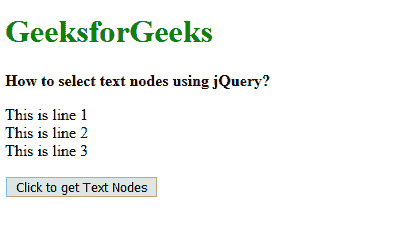
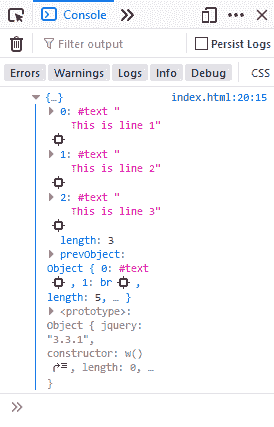

# 如何使用 jQuery 选择文本节点？

> 原文:[https://www . geesforgeks . org/如何使用-jquery 选择文本节点/](https://www.geeksforgeeks.org/how-to-select-text-nodes-using-jquery/)

文本节点是一种表示元素内部实际文本的节点类型。通过选择所有节点并使用**过滤器()**方法检查节点类型属性，可以使用 jQuery 选择任何元素的文本节点。

首先使用 jQuery 选择器选择所需的元素。选择的元素使用 **contents()** 方法。此方法用于返回元素的直接子元素，包括所有文本和注释节点。

对这些返回的元素使用 **filter()** 方法，只过滤需要的文本节点。自定义过滤器功能检查节点的**节点类型**属性是否返回等于**节点。文本 _ 节点**值。

“节点。文本节点”值用于将文本节点与其他节点区分开来。或者，整数值“3”也可以用于标识文本节点。filter()方法现在将只返回文本节点。因此这个方法可以用来选择任何元素的文本节点。

**语法:**

```
selectedElement = $("elementRequired").contents();

textNodes = selectedElement.filter(function () {
  return this.nodeType === Node.TEXT_NODE;
});
```

**示例:**

```
<!DOCTYPE html>
<html>

<head>
    <title>
        How to select text nodes using jQuery?
    </title>

    <script src=
        "https://code.jquery.com/jquery-3.3.1.min.js">
    </script>
</head>

<body>
    <h1 style="color: green">
        GeeksforGeeks
    </h1>

    <b>
        How to select text nodes using jQuery?
    </b>

    <p class="example">
        This is line 1<br>
        This is line 2<br>
        This is line 3
    </p>

    <button onclick="getTextNodes()">
        Click to get Text Nodes
    </button>

    <script type="text/javascript">
        function getTextNodes() {
            selectedElement = $(".example").contents();

            textNodes = selectedElement.filter(function ()
            {
                return this.nodeType === Node.TEXT_NODE;
            });

            console.log(textNodes);
        }
    </script>
</body>

</html>
```

**输出:**

*   **显示:**
    
*   **控制台:**
    