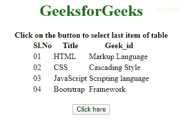

# 如何使用 jQuery 选择表的最后一行？

> 原文:[https://www . geeksforgeeks . org/如何使用-jquery/](https://www.geeksforgeeks.org/how-to-select-the-last-row-of-a-table-using-jquery/) 选择表的最后一行

给定一个 HTML 表，任务是在 jQuery 的帮助下选择表的最后一行。下面用适当的例子讨论两种方法。

**方法 1:** 首先，根据表的 ID 选择表。使用 [**查找()方法**](https://www.geeksforgeeks.org/jquery-find-with-examples/) 查找表格的所有表格行。使用 [**最后()方法**](https://www.geeksforgeeks.org/jquery-last-with-examples/) 得到表的最后一行。最后一个元素的背景色已被更改以查看效果。

*   **例:**

    ```html
    <!DOCTYPE HTML> 
    <html> 
        <head> 
        <title> 
            How to select the last row of
            a table using jQuery?
        </title> 
        <script src = 
    "https://ajax.googleapis.com/ajax/libs/jquery/3.4.0/jquery.min.js">
        </script>
        <style>
            h1 {
                color: green;
            }
        </style>
        </head> 
        <body > 
        <center>
            <h1 > 
                GeeksforGeeks 
            </h1>
            <b>
                Click on the button to select last
                item of table
            </b>
            <table>
            <tr>
                <th>Sl.No</th>
                <th>Title</th>
                <th>Geek_id</th>
            </tr>
            <tr>
                <td>01</td>
                <td>HTML</td>
                <td>Markup Language</td>
            </tr>
            <tr>
                <td>02</td>
                <td>CSS</td>
                <td>Cascading Style</td>
            </tr>
            <tr>
                <td>03</td>
                <td>JavaScript</td>
                <td>Scripting Language</td>
            </tr>
            <tr>
                <td>04</td>
                <td>Bootstrap</td>
                <td>Framework</td>
            </tr>
            </table>
            <br>
            <button onclick = "Geeks()"> 
                Click here
            </button> 
            </center>
            <script> 
                function Geeks() {
                        $('table tr:last')
                        .css("background-color", "yellow");
                }
            </script> 
            </center>
        </body> 
    </html>                    
    ```

*   **输出:** 

**方法 2:** 使用 **$('table tr:last') jQuery 选择器**查找表的最后一个元素。查询中的“table”查找 table 元素，然后“tr”查找 table 元素中的所有行，“last”查找表的最后一行。

*   **例:**

    ```html
    <!DOCTYPE HTML> 
    <html> 
        <head> 
        <title> 
            How to select the last row of
            a table using jQuery?
        </title> 
        <script src = 
    "https://ajax.googleapis.com/ajax/libs/jquery/3.4.0/jquery.min.js">
        </script>
        <style>
            h1 {
                color: green;
            }
        </style>
        </head> 
        <body > 
        <center>
            <h1 > 
                GeeksforGeeks 
            </h1>
            <b>
                Click on the button to select last
                item of table
            </b>
            <table>
            <tr>
                <th>Sl.No</th>
                <th>Title</th>
                <th>Geek_id</th>
            </tr>
            <tr>
                <td>01</td>
                <td>HTML</td>
                <td>Markup Language</td>
            </tr>
            <tr>
                <td>02</td>
                <td>CSS</td>
                <td>Cascading Style</td>
            </tr>
            <tr>
                <td>03</td>
                <td>JavaScript</td>
                <td>Scripting Language</td>
            </tr>
            <tr>
                <td>04</td>
                <td>Bootstrap</td>
                <td>Framework</td>
            </tr>
            </table>
            <br>
            <button onclick = "Geeks()"> 
                Click here
            </button> 
            </center>
            <script> 
               function Geeks() {
                      $('table tr:last')
                      .css("background-color", "yellow");
              }
            </script> 
            </center>
        </body> 
    </html>                    
    ```

*   **输出:** 

jQuery 是一个开源的 JavaScript 库，它简化了 HTML/CSS 文档之间的交互，它以其“少写多做”的理念而闻名。
跟随本 [jQuery 教程](https://www.geeksforgeeks.org/jquery-tutorials/)和 [jQuery 示例](https://www.geeksforgeeks.org/jquery-examples/)可以从头开始学习 jQuery。