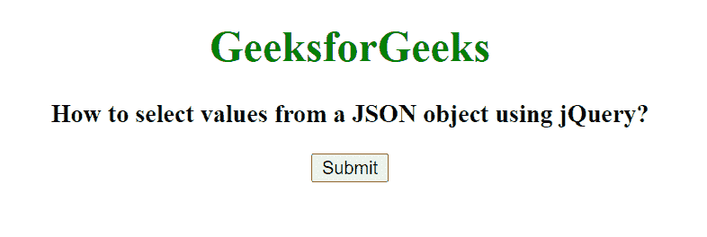
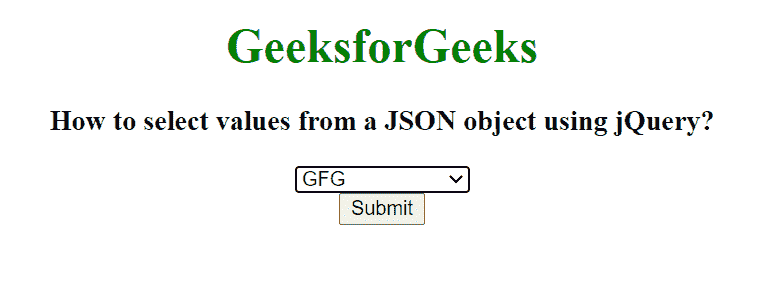

# 如何使用 jQuery 从一个 JSON 对象中选择值？

> 原文:[https://www . geeksforgeeks . org/如何使用-jquery/](https://www.geeksforgeeks.org/how-to-select-values-from-a-json-object-using-jquery/) 从-json-object 中选择值

在本文中，我们将从 JSON 对象中选择值，并使用 jQuery 在浏览器上显示它们。要从 JSON 对象到网页中选择值，我们使用 [append()](https://www.geeksforgeeks.org/jquery-append-method/) 方法。

jQuery 中的 append()方法用于在所选元素的末尾插入一些内容。

**语法:**

```html
$(selector).append( content, function(index, html) )
```

**方法:**首先我们在一个变量中存储一个包含(键，值)对的 JSON 对象。我们已经使用<按钮>元素创建了一个按钮，当我们单击该按钮时，jQuery 函数使用选择器和单击事件调用。点击按钮后，attr()方法添加了名称属性<选择>元素。使用 append()和 each()方法将<选项>元素追加到每个元素中。

**示例:**

## 超文本标记语言

```html
<!DOCTYPE html>
<html lang="en">

<head>
    <title>
        How to select values from a
        JSON object using jQuery?
    </title>

    <!-- Import jQuery cdn library -->
    <script src=
"https://ajax.googleapis.com/ajax/libs/jquery/3.3.1/jquery.min.js">
    </script>

    <script>
        $(document).ready(function () {

            var json = [
                { "name": "GFG", "text": "GFG" },
                { "name": "Geeks", "text": "Geeks" },
                { "name": "GeeksforGeeks", 
                    "text": "GeeksforGeeks" }
            ];

            $('button').click(function () {
                var select = $("<select></select>")
                    .attr("name", "cities");

                $.each(json, function (index, json) {
                    select.append($("<option></option>")
                    .attr("value", json.name).text(json.text));
                });
                $("#GFG").html(select);
            });
        });  
    </script>
</head>

<body style="text-align: center;">
    <h1 style="color: green;">
        GeeksforGeeks
    </h1>

    <h3>
        How to select values from a
        JSON object using jQuery?
    </h3>

    <div id="GFG"></div>

    <button>Submit</button>
</body>

</html>
```

**输出:**

**点击按钮前:**



**点击按钮后:**

