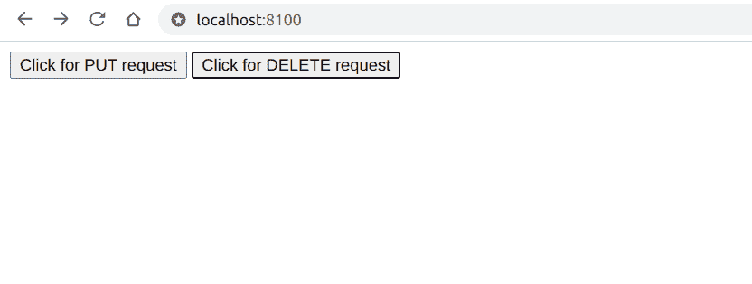

# 如何在 jQuery 中发送 PUT/DELETE 请求？

> 原文:[https://www . geesforgeks . org/how-to-send-a-put-delete-request-in-jquery/](https://www.geeksforgeeks.org/how-to-send-a-put-delete-request-in-jquery/)

在 jQuery 中，我们可以使用*。get()* 方法做出一个 get 请求和*。post()* 方法进行发文请求但没有*。放()*或*。删除()*可用方法。在本文中，我们将看到如何在 jQuery 中发出 *PUT* 和 *DELETE* 请求。

**方法:**要在 jQuery 中发出 *PUT* 或 *DELETE* 请求，我们可以使用*。ajax()* 方法本身。我们可以根据下面示例中给出的要求指定要提交或删除的请求类型。

**示例:**我们将创建一个代码示例，其中我们将创建两个按钮，用于向未知服务器发出 *PUT* 和 *DELETE* 请求。我们将从 Chrome 开发工具的“网络”标签中看到这些请求是否有效。我们将创建一个名为*test.html*的文件，其中包含一个简单的文本 **GeeksforGeeks** ，我们将向其发出 *AJAX* 请求，我们的主文件将是*index.html*。当我们点击这两个按钮中的任何一个时，一个新的名称将出现在网络选项卡中，我们可以点击它来查看*请求方法*选项中的请求类型。我们需要在服务器上运行这个，在截图中 PHP 服务器正在被使用。

**打开开发工具的步骤:**

1.  按 Ctrl + Shift + I。
2.  单击网络选项卡。

## 超文本标记语言

```html
<!DOCTYPE html>
<html lang="en">

<head>
    <meta charset="UTF-8">
    <meta name="viewport" content=
          "width=device-width, initial-scale=1.0">

    <!-- Importing the jQuery -->
    <script src=
"https://cdnjs.cloudflare.com/ajax/libs/jquery/3.3.1/jquery.min.js">
      </script>
</head>

<script>
    function makePUTrequest() {
        $.ajax({
            url: 'test.html',
            type: 'PUT',
            success: function (result) {
                // Do something with the result
            }
        });
    }

    function makeDELETErequest() {
        $.ajax({
            url: 'test.html',
            type: 'DELETE',
            success: function (result) {
                // Do something with the result
            }
        });
    }
</script>

<body>
    <button onclick="makePUTrequest()">
        Click for PUT request
    </button>
    <button onclick="makeDELETErequest()">
        Click for DELETE request
    </button>
</body>

</html>
```

**输出:**



**当我们点击 put 请求按钮时，网络选项卡中的输出:**


**在网络选项卡中输出当我们点击** **删除请求按钮时:**

