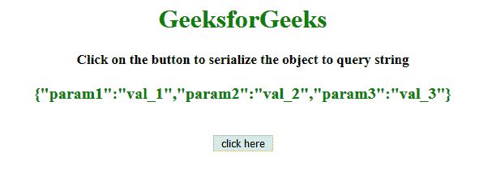
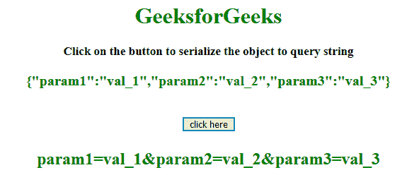
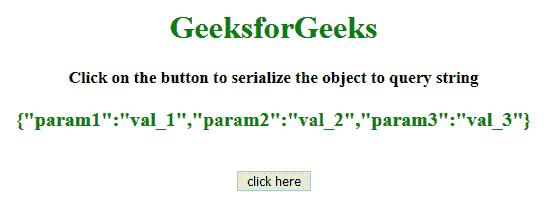
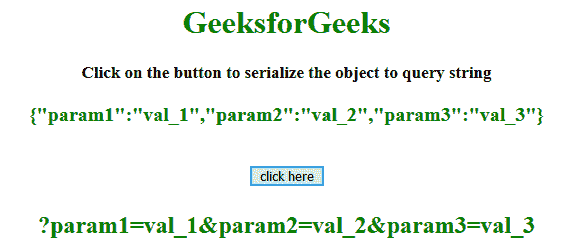

# 如何使用 jQuery 将对象序列化为查询字符串？

> 原文:[https://www . geeksforgeeks . org/如何使用-jquery/](https://www.geeksforgeeks.org/how-to-serialize-an-object-to-query-string-using-jquery/) 将对象序列化为查询字符串

给定一个 JQuery 对象，任务是使用 jQuery 将对象元素序列化为查询字符串。

**方法 1:**

*   声明一个对象并将其存储到变量中。
*   使用 JSON.stringify()方法将对象转换为字符串并显示字符串内容。
*   使用 param()方法将对象元素序列化为查询字符串，并将其存储到变量中。
*   将序列化对象显示为查询字符串。

**示例:**本示例使用 **param()方法**序列化对象。

```
<!DOCTYPE html>
<html>

<head>
    <title>
        JQuery | Serialize object to query string.
    </title>
    <style>
        #GFG_UP {
            font-size: 17px;
            font-weight: bold;
        }

        #GFG_UP2 {
            font-size: 20px;
            font-weight: bold;
            color: green;
        }

        #GFG_DOWN {
            color: green;
            font-size: 24px;
            font-weight: bold;
        }

        button {
            margin-top: 20px;
        }
    </style>
</head>
<script src=
     "https://ajax.googleapis.com/ajax/libs/jquery/3.4.0/jquery.min.js">
</script>

<body style="text-align:center;" id="body">
    <h1 style="color:green;"> 
            GeeksforGeeks 
        </h1>
    <p id="GFG_UP">
    </p>
    <p id="GFG_UP2">
    </p>
    <button>
        click here
    </button>
    <p id="GFG_DOWN">
    </p>
    <script>
        $('#GFG_UP')
        .text('Click the button to serialize the object to query string');
        var data = {
            param1: 'val_1',
            param2: 'val_2',
            param3: 'val_3'
        };
        $('#GFG_UP2').text(JSON.stringify(data));
        $('button').on('click', function() {
            var result = $.param(data);
            $('#GFG_DOWN').text(result);
        });
    </script>
</body>

</html>
```

**输出:**

*   **点击按钮前:**
    
*   **点击按钮后:**
    

**方法 2:**

*   声明一个对象并将其存储到变量中。
*   使用 JSON.stringify()方法将对象转换为字符串并显示字符串内容。
*   单击按钮调用 convert()函数，该函数将序列化对象转换为查询字符串。
*   convert()函数使用 key()和 map()方法将序列化对象转换为查询字符串。

**示例:**本示例创建一个函数，该函数将每个键、值对作为一个字符串追加，以获得查询字符串 **keys()** 和 **map()方法**。

```
<!DOCTYPE html>
<html>

<head>
    <title>
        JQuery | Serialize object to query string.
    </title>
    <style>
        #GFG_UP {
            font-size: 17px;
            font-weight: bold;
        }

        #GFG_UP2 {
            font-size: 20px;
            font-weight: bold;
            color: green;
        }

        #GFG_DOWN {
            color: green;
            font-size: 24px;
            font-weight: bold;
        }

        button {
            margin-top: 20px;
        }
    </style>
</head>
<script src=
    "https://ajax.googleapis.com/ajax/libs/jquery/3.4.0/jquery.min.js">
</script>

<body style="text-align:center;" id="body">
    <h1 style="color:green;"> 
            GeeksforGeeks 
        </h1>
    <p id="GFG_UP">
    </p>
    <p id="GFG_UP2">
    </p>
    <button>
        click here
    </button>
    <p id="GFG_DOWN">
    </p>
    <script>
        $('#GFG_UP')
        .text('Click the button to serialize the object to query string');
        var data = {
            param1: 'val_1',
            param2: 'val_2',
            param3: 'val_3'
        };
        $('#GFG_UP2').text(JSON.stringify(data));

        function convert(json) {
            return '?' +
                Object.keys(json).map(function(key) {
                    return encodeURIComponent(key) + '=' +
                        encodeURIComponent(json[key]);
                }).join('&');
        }
        $('button').on('click', function() {
            var result = convert(data);
            $('#GFG_DOWN').text(result);
        });
    </script>
</body>

</html>
```

**输出:**

*   **点击按钮前:**
    
*   **点击按钮后:**
    