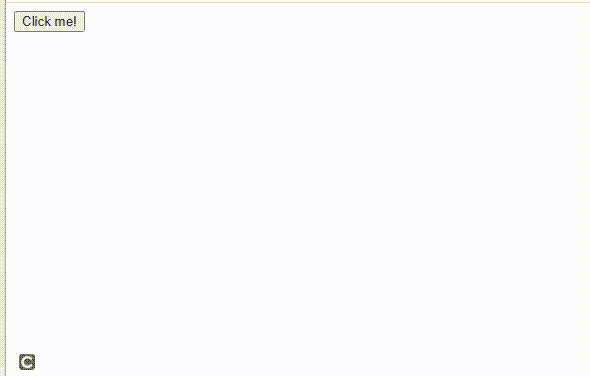

# 如何在 jQuery 中设置按钮点击时的提醒信息？

> 原文:[https://www . geesforgeks . org/如何设置提醒-消息-点击按钮-点击 jquery/](https://www.geeksforgeeks.org/how-to-set-alert-message-on-button-click-in-jquery/)

在本文中，我们将学习如何在单击按钮时在 jQuery 中创建警报消息。为此，我们将使用 jQuery [**点击()**](https://www.geeksforgeeks.org/html-dom-click-method/) 的方法。

**jQuery CDN 链接:**我们已经使用 CDN 链接链接了文件中的 jQuery。

**示例:**创建一个新的 HTML 文件，并向其中添加以下代码。在这个方法中，我们设置了一个警报，并将其链接到一个按钮，这样当该按钮被点击时，警报消息就会弹出。

## 超文本标记语言

```html
<!DOCTYPE html>
<html lang="en">

<head>
    <script src=
        "https://code.jquery.com/jquery-3.6.0.min.js"
        integrity=
"sha256-/xUj+3OJU5yExlq6GSYGSHk7tPXikynS7ogEvDej/m4=" 
        crossorigin="anonymous">
    </script>
</head>

<body>
    <button id="btn">Click me!</button>

    <script>
        $(document).ready(function () {
            $("#btn").click(function () {
                alert("This is an alert message!");
            });
        });
    </script>
</body>

</html>
```

**输出:**



使用点击方法提醒消息