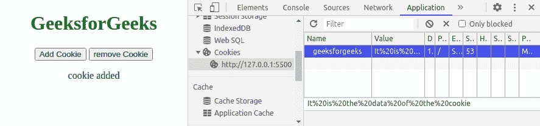

# 如何使用 jQuery 设置和取消设置 cookies？

> 原文:[https://www . geeksforgeeks . org/如何使用-jquery 设置和取消设置 cookie/](https://www.geeksforgeeks.org/how-to-set-and-unset-cookies-using-jquery/)

一个 [**HTTP cookie**](https://www.geeksforgeeks.org/http-headers-cookie/) 是从服务器发送的一小段数据，由浏览器本身存储在客户端，cookie 的制作是为了跟踪用户，也是为了提供一个良好的浏览体验。我们也可以根据需要在浏览器中设置我们的 on cookies。

借助[](https://www.geeksforgeeks.org/how-to-clear-all-cookies-using-javascript/)**或 **jQuery** ，可以在浏览器中设置 Cookies。这里我们将看到如何借助 **jQuery** 在浏览器中设置 cookies，以及稍后如何删除它们。**

**这里我们使用**jQuery**cookie 的 **CDN** 在浏览器中插入一个 cookie。**

****注意:**请在使用本代码时保持您的互联网连接，因为它为 **jQuery** 使用 **CDN** 服务。**

****示例 1:** 在浏览器中设置 cookie 之后，我们将删除该 cookie。**

## **超文本标记语言**

```html
<!DOCTYPE html>
<html lang="en">
   <head>
      <meta charset="UTF-8">
      <meta name="viewport"
            content="width=device-width, initial-scale=1.0">
      <title>Cookie | Geeksforgeeks</title>
      <script src=
"https://code.jquery.com/jquery-3.5.1.min.js"
integrity="sha256-9/aliU8dGd2tb6OSsuzixeV4y/faTqgFtohetphbbj0="
         crossorigin= "anonymous"></script>
      <script src=
"https://cdnjs.cloudflare.com/ajax/libs/jquery-cookie/1.4.1/jquery.cookie.js"></script>
   </head>
   <body>
      <center>  
        <h1 style="color: green">GeeksforGeeks</h1>
        <button onclick="addCookie()">
        Add Cookie
        </button>
        <button onclick="removeCookie()">
        remove Cookie
        </button>

<p></p>

        <script>
            let addCookie=()=>{
            $.cookie("geeksforgeeks", 
            "It is the data of the cookie");
            $("p").text("cookie added");
            }
            let removeCookie=()=>{
            $.removeCookie("geeksforgeeks", 
            "It is the data of the cookie");
            $("p").text("cookie removed");
            }
        </script>
      </center>
   </body>
</html>
```

****输出:**可以清楚的看到有一个名为 **GeeksforGeeks** 的饼干，有一个值。我们还可以设置 cookie 的到期日期。**

*   ****添加饼干前:****

****

*   ****添加饼干后:****

****

*   ****移除饼干后:****

****