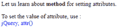
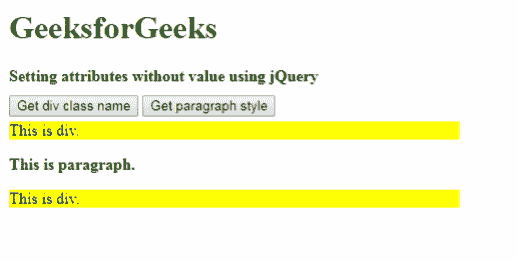
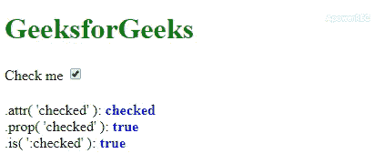

# 如何使用 jQuery 设置不带值的属性？

> 原文:[https://www . geesforgeks . org/如何使用-jquery 设置不带值的属性/](https://www.geeksforgeeks.org/how-to-set-attribute-without-value-using-jquery/)

有很多方法可以使用 jQuery 设置不带值的属性。jQuery **prop()** 方法用于获取或设置属性的值。要更改文档对象模型的属性，如选中、默认选中、禁用、选择索引、默认选中和选定状态，请使用 jQuery **。prop()** 法。同样，我们可以使用 **attr()方法**来实现。在这两种方法下面，通过例子来描述。
**方法 1:** 可以使用 jQuery [**attr()方法**](https://www.geeksforgeeks.org/jquery-attr-method/) ，该方法是为一组匹配元素设置属性，然后传递一个空字符串的函数。这相当于设置了没有值的属性。

*   **语法:**

```
.attr(attribute-name, value to be passed)
```

*   **例 1 :**

## 超文本标记语言

```
<!DOCTYPE html>
<html lang="en">

<head>
    <meta charset="utf-8">
    <title>
      Setting attribute without value
    </title>
    <style>
        div {
            color: blue;
        }
    </style>
    <script src=
"https://code.jquery.com/jquery-3.4.1.js">
    </script>
</head>

<body>

<p>
      Let us learn about
      <b title="jQuery, attr() ">method</b>
      for setting attributes.
    </p>

    To set the value of attribute, use :
    <div></div>

    <script>
        var title = $("b").attr("title");
        $("div").text(title);
    </script>

</body>

</html>
```

*   **输出:**



**方法二:**这是通过使用 jQuery [**prop()方法**](https://www.geeksforgeeks.org/jquery-prop-with-examples/) 来完成的，该方法用于开发仅名称属性。

*   **语法:**

```
prop(para1, para2)
```

*   **例 1 :**

## 超文本标记语言

```
<!DOCTYPE html>
<html>

<head>

    <script src=
"https://ajax.googleapis.com/ajax/libs/jquery/1.11.2/jquery.min.js">
    </script>
    <script>
        $(document).ready(function() {

            $('#btnDiv').click(function() {
                var content = $('.active').attr('class');
                $("#showDivContent").text(content);
            });

            $('#btnPara').click(function() {
                var style = $('p').prop('style');
                var styleName = style.fontWeight
                $("#showParastyle").text(styleName);
            });

        });
    </script>
    <style>
        body {
            width: 450px;
            height: 300px;
            margin: 10px;
            float: left;
        }

        .active {
            background-color: yellow;
            margin: 5px 0 0 0;
        }

        h1 {
            color: green;
        }
    </style>
</head>

<body>
    <h1>GeeksforGeeks</h1>
    <b>
      Setting attributes without value using jQuery
    </b>
    <br>
    <br>
    <button id="btnDiv">
      Get div class name
    </button>
    <button id="btnPara">
      Get paragraph style
    </button>

    <div id="showDivContent"
         class="active">
        This is div.
    </div>
    <p id="showParastyle"
       style="font-size:16px;
              font-weight:bold;">
        This is paragraph.
    </p>

    <div class="active">
        This is div.
    </div>

</body>

</html>
```

*   **输出:**



*   **例 2:**

## 超文本标记语言

```
<!DOCTYPE html>
<html lang="en">

<head>
    <meta charset="utf-8">

    <title>
        Setting attributes without
        values using jQuery
    </title>

    <style>
        p {
            margin: 20px 0 0;
        }
        b {
            color: blue;
        }
    </style>

    <script src=
"https://code.jquery.com/jquery-3.4.1.js">
    </script>
</head>

<body>
    <h1 style="color:green">
        GeeksforGeeks
    </h1>

    <label for="checkboxId">
        Check me
    </label>

    <input id="checkboxId"
        type="checkbox"
        checked="checked">

<p></p>

    <script>
        $("input") .change(function() {
            var $input = $(this);
            $("p").html(".attr( 'checked' ): <b>"
                + $input.attr("checked") + "</b><br>"
                + ".prop( 'checked' ): <b>"
                + $input.prop("checked") + "</b><br>"
                + ".is( ':checked' ): <b>"
                + $input.is(":checked") + "</b>");
        }).change();
    </script>
</body>

</html>
```

*   **输出:**

