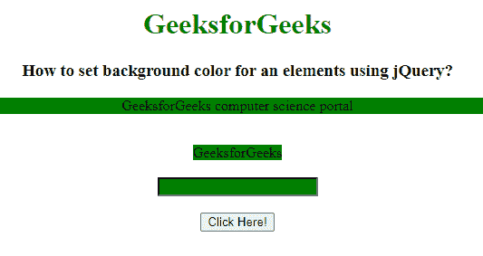

# 如何使用 jQuery 设置一个元素的背景色？

> 原文:[https://www . geeksforgeeks . org/如何使用-jquery/](https://www.geeksforgeeks.org/how-to-set-background-color-for-an-elements-using-jquery/) 为元素设置背景色

在本文中，我们将使用 jQuery 设置元素的背景颜色。要添加背景色，我们使用 css()方法。JQuery 中的 css()方法用于更改所选元素的样式属性。JQuery 中的 css()可以以不同的方式使用。css()方法可用于检查所选元素的属性值。

**语法:**

```html
$(selector).css(property)
```

**返回值:**将返回所选元素的属性值。

**示例:**

## 超文本标记语言

```html
<!DOCTYPE html>
<html lang="en">

<head>
    <title>
        How to set background color
        for an elements using jQuery?
    </title>

    <!-- Import jQuery cdn library -->
    <script src=
"https://ajax.googleapis.com/ajax/libs/jquery/3.3.1/jquery.min.js">
    </script>

    <script>
        $(document).ready(function () {
            $("button").click(function () {
                $("p").add("span").add("input")
                    .css("background", "green");
            });
        });
    </script>
</head>

<body style="text-align: center;">
    <h1 style="color: green;">
        GeeksforGeeks
    </h1>

    <h3>
        How to set background color
        for an elements using jQuery?
    </h3>

    <p>GeeksforGeeks computer science portal</p>
    <br>

    <span>GeeksforGeeks</span>
    <br><br>

    <input type="text">
    <br><br>

    <button>Click Here!</button>
</body>

</html>
```

**输出:**

**点击按钮前:**


**点击按钮后:**

