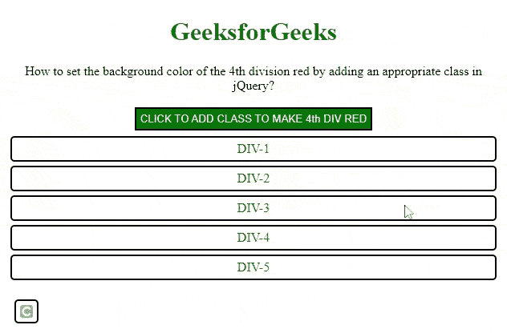
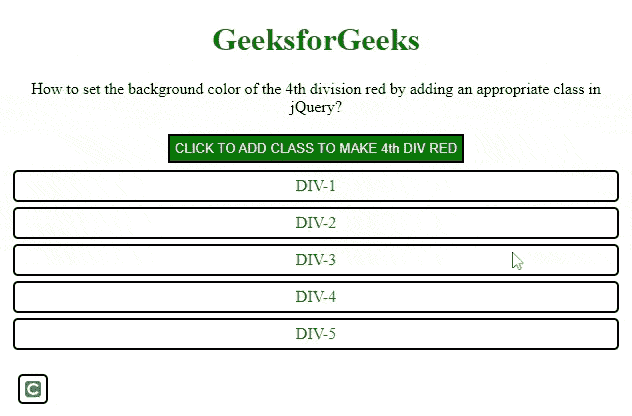

# 如何在 jQuery 中设置特定 div 的背景色？

> 原文:[https://www . geeksforgeeks . org/如何设置特定背景颜色 div in-jquery/](https://www.geeksforgeeks.org/how-to-set-background-color-of-a-particular-div-in-jquery/)

[**【jQuery】**](https://www.geeksforgeeks.org/jquery-tutorials/)**是强大的 JavaScript 库之一，其中包含了很多强大的方法来操纵 DOM 或者选择 DOM 元素以及修改 DOM 元素。**

**在本文中，我们将通过在 jQuery 中添加一个适当的类来将第四分区的背景色设置为红色。**

****方法:**可以使用[**eq()**](https://www.geeksforgeeks.org/jquery-eq-with-examples/) 方法来定位 DOM 中元素的第 I 次<sup>出现。 **eq()** 方法返回所选元素的 DOM 的第 i <sup>个</sup>元素。它考虑基于 0 的索引。</sup>**

****语法:****

```html
$('selector').eq(index)
```

***指数*是**方程()**方法中的参数，可以是正的也可以是负的。如果它是正的，那么它从 0 开始。如果为负，则考虑从头索引。**

****方法 1:** 使用 [jQuery 选择器](https://www.geeksforgeeks.org/jquery-element-selector/)选择身体。从正文中找到第四个 *div* ，然后使用 [**addClass()**](https://www.geeksforgeeks.org/jquery-addclass-with-examples/) 函数将该类添加到返回的 jQuery 对象中。由于是基于 0 的索引，我们在第三个索引处选择 *div* 。**

****示例:****

## **超文本标记语言**

```html
<!DOCTYPE html>
<html lang="en">

<head>
    <meta charset="UTF-8">
    <meta http-equiv="X-UA-Compatible" 
            content="IE=edge">

    <meta name="viewport" content=
        "width=device-width, initial-scale=1.0">

    <!-- Including jQuery  -->
    <script src=
"https://code.jquery.com/jquery-3.6.0.min.js"
        integrity=
"sha256-/xUj+3OJU5yExlq6GSYGSHk7tPXikynS7ogEvDej/m4=" 
        crossorigin="anonymous">
    </script>

    <style>
        h1 {
            color: #006600;
        }

        body {
            text-align: center;
        }

        div {
            text-align: center;
            padding: 5px;
            border: 2px solid black;
            border-radius: 5px;
            margin: 5px;
            color: #006600
        }

        #btn {
            margin: 2px;
            padding: 5px;
            border: 2px solid black;
            background-color: #006600;
            color: whitesmoke;
            width: auto
        }

        /* The class that turns the div's 
        background colour to red */
        .newClass {
            background-color: red;
            color: white;
        }
    </style>
</head>

<body>
    <h1> GeeksforGeeks</h1>
    <p>
        How to set the background color 
        of the 4th division red by adding 
        an appropriate class in jQuery?
    </p>

    <button id="btn">
        CLICK TO ADD CLASS TO MAKE 4th DIV RED 
    </button>

    <div> DIV-1 </div>
    <div> DIV-2 </div>
    <div> DIV-3 </div>
    <div> DIV-4 </div>
    <div> DIV-5 </div>

    <script>
        $(document).ready(function () {

            // Selecting the body using selector
            // finding the 4th div i.e 0 based indexing 
            // adding a class
            $('#btn').click(function () {
                $('body div').eq(3).addClass('newClass');
            })
        });
    </script>
</body>

</html>
```

****输出:****

****

****方法 2:** 以下示例通过使用 **eq()** 方法选择身体的第 4 个 *div* 并使用 [**css()**](https://www.geeksforgeeks.org/jquery-css-method/) 方法选择样式来实现。**

## **超文本标记语言**

```html
<!DOCTYPE html>
<html lang="en">

<head>
    <meta charset="UTF-8">
    <meta http-equiv="X-UA-Compatible" 
        content="IE=edge">
    <meta name="viewport" content=
        "width=device-width, initial-scale=1.0">

    <!-- Including jQuery  -->
    <script src=
"https://code.jquery.com/jquery-3.6.0.min.js"
        integrity=
"sha256-/xUj+3OJU5yExlq6GSYGSHk7tPXikynS7ogEvDej/m4="
        crossorigin="anonymous">
    </script>

    <style>
        h1 {
            color: #006600;
        }

        body {
            text-align: center;
        }

        div {
            text-align: center;
            padding: 5px;
            border: 2px solid black;
            border-radius: 5px;
            margin: 5px;
            color: #006600
        }

        #btn {
            margin: 2px;
            padding: 5px;
            border: 2px solid black;
            background-color: #006600;
            color: whitesmoke;
            width: auto
        }
    </style>
</head>

<body>
    <h1>GeeksforGeeks</h1>

    <p>
        How to set the background color 
        of the 4th division red by adding 
        an appropriate class in jQuery?
    </p>

    <button id="btn">
        CLICK TO ADD CLASS TO MAKE 4th DIV RED
    </button>

    <div> DIV-1 </div>
    <div> DIV-2 </div>
    <div> DIV-3 </div>
    <div> DIV-4 </div>
    <div> DIV-5 </div>

    <script>
        $(document).ready(function () {

            // Selecting the body using selector
            // finding the 4th div i.e 0 based indexing 
            // Adding a class
            $('#btn').click(function () {
                $('body div').eq(3).css({ 
                    'background-color': 'red', 
                    'color': 'white' 
                });
            })
        });
    </script>
</body>

</html>
```

****输出:****

****