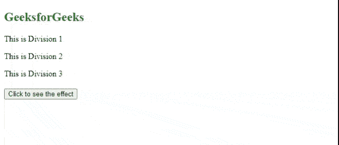
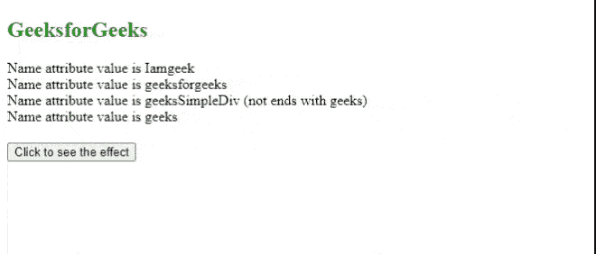

# jQuery 中属性名以‘极客’结尾的所有 div 背景色如何设置？

> 原文:[https://www . geeks forgeeks . org/如何设置所有属性名称以 geeks in-jquery 结尾的 div 背景色/](https://www.geeksforgeeks.org/how-to-set-background-color-of-all-divs-in-which-attribute-name-ends-with-geeks-in-jquery/)

在本文中，我们将选择名称属性值以“极客”结尾的所有 HTML [*div 的*](https://www.geeksforgeeks.org/div-tag-html/) ，并使用 CSS 背景属性将[背景颜色](https://www.geeksforgeeks.org/css-background-color-property/)设置为*绿色*。

**语法:**下面的语法可以用来得到上面的。

```html
$( "div[name$='geeks']" ).css( "background", "green" );
```

**进场:**

*   创建一些标签，其中一些名称属性值以“极客”结尾。
*   创建一些普通的 *div* 标签来区分。
*   创建一个调用 jQuery 方法的按钮。
*   创建 jQuery 方法，选择名称属性值以“极客”结尾的所有 *div* ，并将背景颜色设置为绿色。

**示例 1:** 本示例有三个 *div* 标签。其中两个名字属性的值以“极客”结尾，第三个是普通的*分区*。当我们点击按钮时，前两个 div 的背景颜色将设置为绿色。

## 超文本标记语言

```html
<!DOCTYPE html>
<html>

<head>
    <script src=
"https://code.jquery.com/jquery-git.js">
    </script>

    <meta charset="utf-8">
    <meta name="viewport" 
        content="width=device-width">

    <style type="text/css">
        button {
            display: block;
            margin: 20px 0 0 0;
        }
    </style>

    <script>
        $(document).ready(function () {
            $('#button').click(function () {
                $("div[name$='geeks']")
                    .css("background", "green");
            });
        });
    </script>
</head>

<body>
    <h2 style="color:green">
        GeeksforGeeks
    </h2>

    <div name="Iamgeeks">
        <p>This is Division 1</p>
    </div>

    <div name="geeksforgeeks">
        <p>This is Division 2</p>
    </div>

    <div name="simplediv">
        <p>This is Division 3</p>
    </div>
    <button id="button">
        Click to see the effect
    </button>
</body>

</html>
```

**输出:**



**示例 2:** 本示例有四个 *div* 标签。第一、二、四 *div* 名称属性以“极客”结尾，但第三 *div* 名称属性不以“极客”关键字结尾。这意味着，第三个 div 的背景不会改变。

## 超文本标记语言

```html
<!DOCTYPE html>
<html>

<head>
    <script src=
"https://code.jquery.com/jquery-git.js">
    </script>

    <meta charset="utf-8">
    <meta name="viewport" 
        content="width=device-width">

    <style type="text/css">
        button {
            display: block;
            margin: 20px 0 0 0;
        }
    </style>
    <script>
        $(document).ready(function () {
            $('#button1').click(function () {
                $("div[name$='geeks']")
                .css("background", "green");
            });
        });
    </script>
</head>

<body>
    <h2 style="color:green">
        GeeksforGeeks
    </h2>

    <div name="Iamgeeks">
        Name attribute value is Iamgeeks
    </div>

    <div name="geeksforgeeks">
        Name attribute value is geeksforgeeks
    </div>

    <div name="geekssimplediv">
        Name attribute value is geeksSimpleDiv 
        (not ends with geeks)
    </div>

    <div name="geeks">
        Name attribute value is geeks
    </div>

    <button id="button1">
        Click to see the effect
    </button>
</body>

</html>
```

**输出:**

