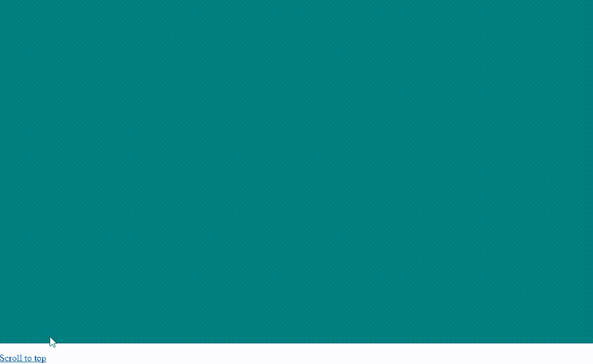

# 如何使用 jQuery 设置平滑滚动从顶部停止在特定位置？

> 原文:[https://www . geeksforgeeks . org/如何使用-jquery/](https://www.geeksforgeeks.org/how-to-set-smooth-scrolling-to-stop-at-a-specific-position-from-the-top-using-jquery/) 设置平滑滚动到特定位置停止

jQuery 中的 **scrollTop()** 方法用于滚动到页面的特定部分。使用可用的内置动画制作此方法的动画可以使滚动更加平滑。并且，从中减去指定的值将使滚动从顶部停止。

**方法:**首先使用 hash 属性提取锚点链接的 hash 部分，然后使用 **offset()** 方法找出它在页面上的位置。然后在该哈希值上调用 **scrollTop()** 方法滚动到该位置。此方法通过将其包含在 **animate()** 方法中并指定要使用的动画持续时间(以毫秒为单位)来制作动画。较大的值会使动画比较小的值完成得更慢。这将在点击页面上的所有锚点链接时平滑地制作动画。然后我们将减去指定的值，停止平滑滚动，从顶部停止。

**示例:**

## 超文本标记语言

```html
<!DOCTYPE html>
<html>

<head>
    <title>
        How to set smooth scrolling to stop at
        a specific position from the top using
        jQuery?
    </title>

    <!-- JQuery Script -->
    <script src=
        "https://code.jquery.com/jquery-3.4.1.min.js">
    </script>

    <!-- Style to make scrollbar appear -->
    <style>
        .scroll {
            height: 1000px;
            background-color: teal;
            color: white;
        }
    </style>
</head>

<body>
    <h1 style="color: green">
        GeeksforGeeks
    </h1>

    <b>
        How to set smooth scrolling to stop at
        a specific position from the top using
        jQuery?
    </b>

    <p id="dest">
        Click on the button below to
        scroll to the top of the page.
    </p>

    <p class="scroll">
        GeeksforGeeks is a computer science
        portal. This is a large scrollable
        area.
    </p>

    <a href="#dest">
        Scroll to top
    </a>

    <!-- jQuery for smooth scrolling to a
        specific position from top -->
    <script>

        // Define selector for selecting
        // anchor links with the hash
        let anchorSelector = 'a[href^="#"]';

        $(anchorSelector).on('click', function (e) {

            // Prevent scrolling if the
            // hash value is blank
            e.preventDefault();

            // Get the destination to scroll to
            // using the hash property
            let destination = $(this.hash);

            // Get the position of the destination
            // using the coordinates returned by
            // offset() method and subtracting 50px
            // from it.
            let scrollPosition
                = destination.offset().top - 50;

            // Specify animation duration
            let animationDuration = 500;

            // Animate the html/body with
            // the scrollTop() method
            $('html, body').animate({
                scrollTop: scrollPosition
            }, animationDuration);
        });
    </script>
</body>

</html>
```

**输出:**

