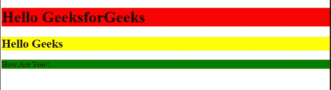
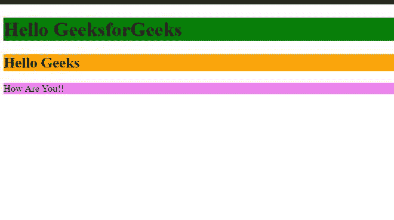

# 如何使用 jQuery 设置指定元素的背景色？

> 原文:[https://www . geeksforgeeks . org/如何使用-jquery 设置指定元素的背景颜色/](https://www.geeksforgeeks.org/how-to-set-the-background-color-of-the-specified-elements-using-jquery/)

在本文中，我们将看到如何使用 jQuery 设置特定元素的背景色。

要设置*背景色*，我们使用 [**css()**](https://www.geeksforgeeks.org/jquery-css-method/) 方法。这个方法帮助我们动态添加 [CSS 属性](https://www.geeksforgeeks.org/how-to-add-css-properties-to-an-element-dynamically-using-jquery/)。

**语法:**

```html
$("tag-name").css("property-name", "value");
```

**方法:**我们在 body tag 内部创建了三个元素，即< h1 >、< h2 >和< p >元素。我们将 CSS 属性应用于所有元素，即< h1 >、< h2 >和< p >。

**示例 1:** 在本例中，我们将使用 **CSS()** 方法，该方法为我们的元素动态设置背景颜色。

## 超文本标记语言

```html
<!DOCTYPE html>
<html lang="en">
<head>
    <meta charset="UTF-8">
    <meta http-equiv="X-UA-Compatible" content="IE=edge">
    <meta name="viewport" content="width=device-width, 
                                   initial-scale=1.0">
    <script src=
"https://ajax.googleapis.com/ajax/libs/jquery/3.2.1/jquery.min.js">
    </script>
    <script>
        $(document).ready(function(){
           $("h1").css("background-color" ,  "red");
           $("h2").css("background-color" ,  "yellow");
           $("p").css("background-color" ,  "green");
        });
    </script>
</head>
<body>
    <h1>Hello GeeksforGeeks</h1>
    <h2>Hello Geeks</h2>
    <p>How Are You!!</p>

</body>
</html>
```

**输出:**



背景色

**示例 2:** 在本例中，我们将使用 [**addClass()**](https://www.geeksforgeeks.org/jquery-addclass-with-examples/) 方法来设置元素的背景颜色。

## 超文本标记语言

```html
<!DOCTYPE html>
<html lang="en">
<head>
    <meta charset="UTF-8">
    <meta http-equiv="X-UA-Compatible" content="IE=edge">
    <meta name="viewport" content="width=device-width, 
                                   initial-scale=1.0">
    <script src=
"https://ajax.googleapis.com/ajax/libs/jquery/3.2.1/jquery.min.js"> 
    </script>
    <script>
        $(document).ready(function(){
            $("h1").addClass("first");
            $("h2").addClass("second");
            $("p").addClass("third");
         });
    </script>
    <style>
        .first{
            background-color:green;
        }
        .second{
            background-color:orange;
        }
        .third{
            background-color:violet;
        }
    </style>
</head>
<body>
    <h1>Hello GeeksforGeeks</h1>
    <h2>Hello Geeks</h2>
    <p>How Are You!!</p>

</body>
</html>
```

**Output:**
